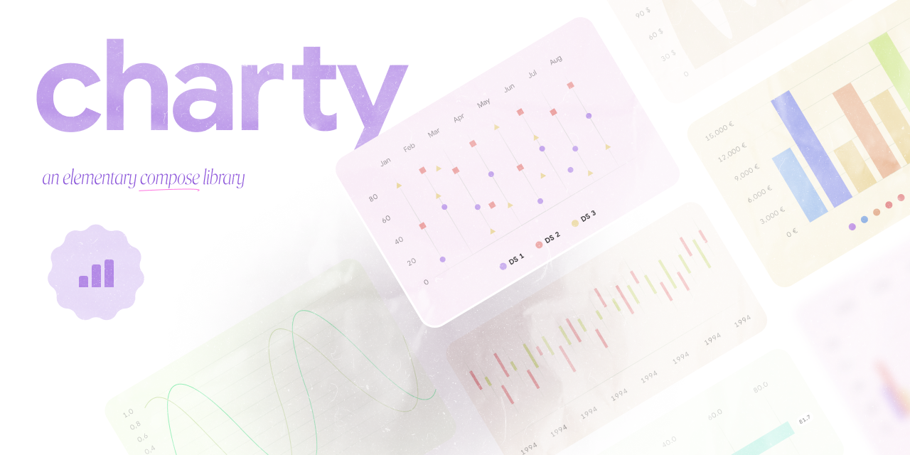

# 🎯 Charty — the charting library for Compose Multiplatform



> A sleek, lightweight charting library for Jetpack Compose — and, uniquely, for **Kotlin Multiplatform**: one codebase renders your charts on **Android, iOS, Desktop, and the Web**.
> *Built with ❤️ by [@hi-manshu](https://github.com/hi-manshu).*

[](https://github.com/hi-manshu)
[](https://twitter.com/hi_man_shoe)
[](https://androidweekly.net/issues/issue-532)


---

## ▶️ Try it live in your browser

**[Open the interactive playground →](https://hi-manshu.github.io/charty/)** — every chart in the catalog below, with its configuration exposed as controls you can turn. Change the data, the axes, the animation, the theme, and watch it re-render instantly. No install, no emulator: it is the same Compose code you would ship, running in your browser via WebAssembly.

It also carries live sandboxes for streaming, synced crosshairs, PNG export, tooltips, and interpolation — each showing the exact Kotlin that produced what you are looking at.

---

## ✨ Why Charty

- 🌍 **Truly multiplatform.** Android (minSdk 24), iOS, JVM Desktop, and JS/Wasm in the browser — from a single `commonMain` API. Most Compose chart libraries are Android-only.
- 📊 **~25 chart types** out of the box, from bar/line/area to radar, candlestick, and calendar heatmaps.
- 📡 **Live streaming data** — a rolling `visibleWindow` that slides as points arrive, with an easing axis rescale, drag-back-through-history scrollback, and a built-in "jump to latest" pill. [Guide →](docs/charty/guides/streaming.md)
- 👆 **Rich interactions** — a unified draggable **crosshair**, tap tooltips (canvas or your own Composable), drag-to-track tooltips, persistent markers, zoom/pan, and brush selection.
- 🔗 **Synced crosshair** — wrap stacked charts in `CrosshairSyncScope { }` and one guide line moves across all of them. Charts enrol themselves. [Guide →](docs/charty/guides/synced-crosshair.md)
- 🖼️ **PNG export** — capture any chart and hand it to the platform: share sheet on iOS, browser download on the web, Downloads folder on desktop, app cache on Android. [Guide →](docs/charty/guides/exporting-charts.md)
- 🕒 **Smart datetime axis** — adaptive tick granularity from minutes to decades, snapped to natural boundaries, fully localizable through `DateTimeAxisLocale` without the library shipping a locale database. [Guide →](docs/charty/guides/datetime-axis.md)
- ✨ **Motion that means something** — tween, spring, or disabled entry animations; `animateValueChanges` tweens values when the data updates; three line interpolations (linear, smooth, step).
- ⚡ **Scales to big data** — built-in **LTTB downsampling** keeps tens of thousands of points at interactive frame rates.
- ♿ **Accessible** — whole-chart descriptions **and** per-data-point screen-reader traversal, so TalkBack/VoiceOver users can inspect each value.
- 🎨 **Themeable** — light/dark-aware `ChartyTheme`, `ChartyColor` solids & gradients everywhere a colour is exposed, graceful empty/loading states.
- 🧊 **Optional 3D** — an extruded bar and a tilted pie in a separate `charty-3d` artifact, so a project that does not want them does not carry them. [When not to use it →](docs/charty/charts/3d/README.md)
- 📦 **Ships an Android baseline profile** in the AAR, so consuming apps get Charty's hot paths AOT-compiled at install (no first-render jank).

---

## 🚀 Quick start

Charty is on **Maven Central** (`com.himanshoe:charty`). Use the latest version from the badge above.

**Kotlin Multiplatform** (`build.gradle.kts`):

```kotlin
kotlin {
    sourceSets {
        commonMain.dependencies {
            implementation("com.himanshoe:charty:<latest-version>")
        }
    }
}
```

**Android-only:**

```kotlin
dependencies {
    implementation("com.himanshoe:charty:<latest-version>")
}
```

The 3D charts live in a second artifact with its own version, and are opt-in on purpose — see [charty-3d](docs/charty/charts/3d/README.md). It declares the `charty` it was built against, so the pair always resolves correctly:

```kotlin
implementation("com.himanshoe:charty-3d:1.0.0")
```

Your first chart is three lines:

```kotlin
LineChart(
    data = { listOf(LineData("Mon", 20f), LineData("Tue", 45f), LineData("Wed", 30f)) },
    color = ChartyColor.Solid(ChartyColors.Blue),
)
```

Add interactions and styling declaratively:

```kotlin
LineChart(
    data = { priceData },
    color = ChartyColor.Solid(ChartyColors.Blue),
    lineConfig = LineChartConfig(
        interpolation = LineInterpolation.SMOOTH,
        downsampleThreshold = 800,          // stay smooth over huge series
    ),
    crosshair = ChartCrosshair(),            // draggable guide line + label
)
```

Or go live — a rolling window that slides as data arrives, with scrollback:

```kotlin
val streaming = rememberStreamingState()

LineChart(
    data = { readings },                     // just keep appending
    color = ChartyColor.Solid(ChartyColors.Blue),
    lineConfig = LineChartConfig(
        visibleWindow = 30,                  // show the last 30 points
        markers = listOf(PersistentMarker(dataIndex = -1)),   // label the newest
    ),
    interactionConfig = ChartInteractionConfig(
        streamingState = streaming,          // drag back through history
        jumpToLatest = { state -> ChartJumpToLatestPill(state = state) },
    ),
)
```

---

## 📈 Chart catalog

| Family | Charts |
| --- | --- |
| **Bar** | [Bar](docs/charty/charts/bar/BarChart.md), [Horizontal](docs/charty/charts/bar/HorizontalBarChart.md), [Stacked](docs/charty/charts/bar/StackedBarChart.md), [Stacked-Horizontal](docs/charty/charts/bar/StackedHorizontalBarChart.md), [Grouped-Horizontal](docs/charty/charts/bar/GroupedHorizontalBarChart.md), [Normalized-Horizontal](docs/charty/charts/bar/NormalizedHorizontalBarChart.md), [Mosaic](docs/charty/charts/bar/MosaicBarChart.md), [Span](docs/charty/charts/bar/SpanChart.md), [Comparison](docs/charty/charts/bar/ComparisonBarChart.md), [Diverging](docs/charty/charts/bar/DivergingBarChart.md), [Waterfall](docs/charty/charts/bar/WaterfallChart.md), [Lollipop](docs/charty/charts/bar/LollipopBarChart.md), [Bubble-bar](docs/charty/charts/bar/BubbleBarChart.md), [Wavy](docs/charty/charts/bar/WavyChart.md) |
| **Line / Area** | [Line](docs/charty/charts/line/LineChart.md), [Area](docs/charty/charts/line/AreaChart.md), [Multiline](docs/charty/charts/line/MultilineChart.md), [Stacked-Area](docs/charty/charts/line/StackedAreaChart.md), [Sparkline](docs/charty/charts/line/Sparkline.md) |
| **Point** | [Scatter (Point)](docs/charty/charts/other/PointChart.md), [Bubble](docs/charty/charts/other/BubbleChart.md) |
| **Combo** | [Bars + line, optional secondary axis](docs/charty/charts/other/ComboChart.md) |
| **Circular** | [Pie](docs/charty/charts/radial/PieChart.md), [Donut](docs/charty/charts/radial/PieChart.md), [Radar](docs/charty/charts/radial/RadarChart.md), [Multiple-Radar](docs/charty/charts/radial/MultipleRadarChart.md), [Circular progress](docs/charty/charts/radial/CircularProgressIndicator.md), [Angular gauge](docs/charty/charts/radial/AngularGaugeChart.md) |
| **3D** (opt-in `charty-3d`) | [Bar3D](docs/charty/charts/3d/Bar3DChart.md), [Pie3D](docs/charty/charts/3d/Pie3DChart.md) |
| **Specialised** | [Candlestick (OHLC)](docs/charty/charts/other/CandlestickChart.md), [Calendar heatmap](docs/charty/charts/other/CalendarHeatmapChart.md), [Matrix heatmap](docs/charty/charts/other/MatrixHeatmapChart.md), [Gantt](docs/charty/charts/other/GanttChart.md), [Funnel](docs/charty/charts/other/FunnelChart.md), [Block bar](docs/charty/charts/radial/BlockBarChart.md) |

Explore every one in the **[live playground](https://hi-manshu.github.io/charty/)**.

---

## ⚡ Performance

Charty reduces large series to a shape-preserving subset with the **Largest-Triangle-Three-Buckets (LTTB)** algorithm before drawing, so a 50k-point line stays interactive. The pure compute paths are micro-benchmarked (`./gradlew :benchmark:mainBenchmark`):

| Operation | Cost |
| --- | --- |
| LTTB downsample, 50,000 → 800 points | ~0.16 ms |
| Axis min/max over 50,000 points | ~0.09 ms |
| 10,000 value→pixel transforms | ~0.07 ms |

_Measured on a dev machine (JMH average time); treat as orders of magnitude, not guarantees._ Enable it per chart with `downsampleThreshold`.

---

## ♿ Accessibility

Every Cartesian chart exposes a generated whole-chart `contentDescription`, and — because charts are canvas-drawn — an overlay of invisible, focusable nodes so screen readers can **traverse the data point by point** ("Point 2 of 5: Feb, 45"). The nodes carry no pointer input, so they never change the chart's look or block touch.

Per-point traversal is wired in by the charts themselves — no opt-in needed — across the line, area, bar (including stacked, normalized, mosaic, comparison, span, lollipop and bubble-bar variants), point, bubble, combo, and candlestick charts. Override any chart's summary with `ChartInteractionConfig(accessibilityDescription = "…")`, or pass `""` to suppress it.

---

## 🔍 How Charty compares

| | **Charty** | Vico | MPAndroidChart |
| --- | --- | --- | --- |
| Android | ✅ | ✅ | ✅ |
| iOS / Desktop / **Web** | ✅ | ❌ | ❌ |
| Jetpack Compose–native | ✅ | ✅ | ❌ (Views) |
| Live in-browser demo | ✅ | ❌ | ❌ |
| Rolling live-data window + scrollback | ✅ | partial | ❌ |
| Crosshair synced across charts | ✅ | ❌ | ❌ |
| Multiplatform PNG export | ✅ | ❌ | Android only |
| Large-data downsampling | ✅ (LTTB) | partial | ❌ |
| Per-point screen-reader traversal | ✅ | ❌ | limited |
| Ships a baseline profile | ✅ | ❌ | ❌ |

_Vico and MPAndroidChart are excellent, mature libraries on Android — Charty's edge is being the Compose-native option that runs everywhere Kotlin does._

---

## 📚 Documentation

Full API reference and guides: 👉 **[himanshoe.com/docs/charty](https://himanshoe.com/docs/charty)**

Start here:

| Guide | What it covers |
| --- | --- |
| [Installation](docs/charty/getting-started/installation.md) | One dependency, five targets. |
| [Quick start](docs/charty/getting-started/quick-start.md) | Zero to a rendered chart in two minutes. |
| [Streaming and live data](docs/charty/guides/streaming.md) | Rolling windows, scrollback, jump-to-latest. |
| [Exporting charts as PNG](docs/charty/guides/exporting-charts.md) | Capture and share, per platform. |
| [Datetime axis and localization](docs/charty/guides/datetime-axis.md) | Smart time ticks in any language. |
| [Synced crosshair](docs/charty/guides/synced-crosshair.md) | One guide line across stacked charts. |
| [Interactions](docs/charty/configurations/interactions.md) | Which gestures can share a chart. |
| [Common configuration](docs/charty/configurations/common-config.md) | Axes, tooltips, markers, windows. |
| [Colors and animations](docs/charty/customization/colors-and-animations.md) | `ChartyColor`, palettes, `Animation`. |
| [Changelog](CHANGELOG.md) | What changed, and what to do about the breaking bits. |
| [Theming](docs/charty/customization/theming.md) | Point charts at your design system in one place. |
| [charty-3d](docs/charty/charts/3d/README.md) | The opt-in 3D artifact, and when not to use it. |

---

## 🚀 Apps using Charty

| App | Link |
| --- | --- |
| 🐱 **NEKO** | [github.com/nekomangaorg/Neko](https://github.com/nekomangaorg/Neko) |
| ⏱️ **TimePlanner** | [github.com/v1tzor/TimePlanner](https://github.com/v1tzor/TimePlanner) |

Using Charty? Open a PR to add your app.

---

## ⚖️ License

```text
Copyright 2025 The Charty Authors

Licensed under the Apache License, Version 2.0 (the "License");
you may not use this file except in compliance with the License.
You may obtain a copy of the License at

    http://www.apache.org/licenses/LICENSE-2.0

Unless required by applicable law or agreed to in writing, software
distributed under the License is distributed on an "AS IS" BASIS,
WITHOUT WARRANTIES OR CONDITIONS OF ANY KIND, either express or implied.
See the License for the specific language governing permissions and
limitations under the License.
```

---

## 🌟 Support

If Charty helps you, please ⭐ the repo — it genuinely helps.

## ☕ Sponsor

If Charty saves you time, consider buying me a coffee!

[](https://buymeacoffee.com/himanshoe)
