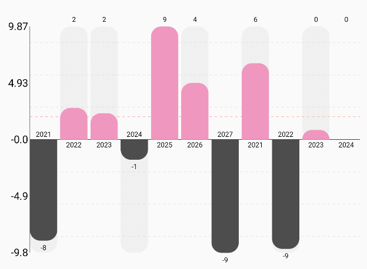

# Bar Chart



## Overview
A highly customizable and interactive bar chart Composable designed for displaying a list of bars with optional target indicators, tooltips, and click interactions. This component is flexible enough to be used in dashboards, analytical tools, or any visual data representation context in a Jetpack Compose application.

## 📦 Package

```kotlin
import com.himanshoe.charty.bar
```

## 🧱 Declaration
```kotlin
@Composable
fun BarChart(
    data: () -> List<BarData>,
    modifier: Modifier = Modifier,
    target: Float? = null,
    targetConfig: TargetConfig = TargetConfig.default(),
    barChartConfig: BarChartConfig = BarChartConfig.default(),
    labelConfig: LabelConfig = LabelConfig.default(),
    barTooltip: BarTooltip? = null,
    barChartColorConfig: BarChartColorConfig = BarChartColorConfig.default(),
    onBarClick: (Int, BarData) -> Unit = { _, _ -> },
)
```

## 🔧 Parameters
| Parameter             | Type                     | Description                                                                                                                                         |
|-----------------------|--------------------------|-----------------------------------------------------------------------------------------------------------------------------------------------------|
| `data`                | `() -> List<BarData>`    | A lambda returning the list of `BarData` entries to be displayed in the chart. The list determines the number and height of bars.                   |
| `modifier`            | `Modifier`               | Optional Compose `Modifier` for layout behavior, styling, padding, etc.                                                                             |
| `target`              | `Float?`                 | Optional float value indicating a target or benchmark line to be displayed across the chart. If `null`, no target line is shown.                    |
| `targetConfig`        | `TargetConfig`           | Configuration for the appearance of the target line, such as color, stroke, and label visibility. Use `TargetConfig.default()` for default styling. |
| `barChartConfig`      | `BarChartConfig`         | Governs bar spacing, corner radius, chart padding, and other display properties. Customize using `BarChartConfig`.                                  |
| `labelConfig`         | `LabelConfig`            | Controls how labels for each bar are rendered (font size, visibility, position, etc.).                                                              |
| `barTooltip`          | `BarTooltip?`            | Optional tooltip configuration shown on long-press or hover over a bar. Set to `null` to disable tooltips.                                          |
| `barChartColorConfig` | `BarChartColorConfig`    | Specifies the color scheme for bars, labels, backgrounds, and the target line. Use `BarChartColorConfig.default()` for standard colors.             |
| `onBarClick`          | `(Int, BarData) -> Unit` | Lambda called when a bar is clicked. Provides the index of the bar and the corresponding `BarData`. Default is a no-op.                             |


## 🧮 BarData Model
| Property             | Type         | Description                                                                                                                                                                      |
|----------------------|--------------|----------------------------------------------------------------------------------------------------------------------------------------------------------------------------------|
| `yValue`             | `Float`      | The numeric value to be plotted on the **y-axis**. This determines the height of the bar.                                                                                        |
| `xValue`             | `Any`        | The corresponding value for the **x-axis**. It can represent a label, date, or category and can be of any type.                                                                  |
| `barColor`           | `ChartColor` | The fill color of the bar. Defaults to `Color.Unspecified` converted to `SolidChartColor`.                                                                                       |
| `barBackgroundColor` | `ChartColor` | The background color behind the filled portion of the bar, typically used to indicate the max range or to add contrast. Defaults to a semi-transparent light gray (`#40D3D3D3`). |


> You can find a mock implementation in sample module's App file

## Example Usage

```kotlin
private fun LazyListScope.addBarChart(target: Float?, data: List<BarData>) {
    item {
        BarChart(
            modifier = Modifier.padding(10.dp).fillMaxWidth().height(300.dp),
            target = target,
            barTooltip = BarTooltip.GraphTop,
            labelConfig = LabelConfig.default().copy(
                showXLabel = true,
                xAxisCharCount = 4,
                showYLabel = true,
                textColor = Color.Black.asSolidChartColor()
            ),
            barChartColorConfig = BarChartColorConfig.default().copy(
                fillBarColor = Color(0xFFFF92C1).asSolidChartColor(),
                negativeBarColors = Color(0xFF4D4D4D).asSolidChartColor()
            ),
            data = { data },
            barChartConfig = BarChartConfig.default().copy(
                cornerRadius = CornerRadius(40F, 40F),
            ),
            onBarClick = { index, barData -> println("click in bar with $index index and data $barData") }
        )
    }
}
```