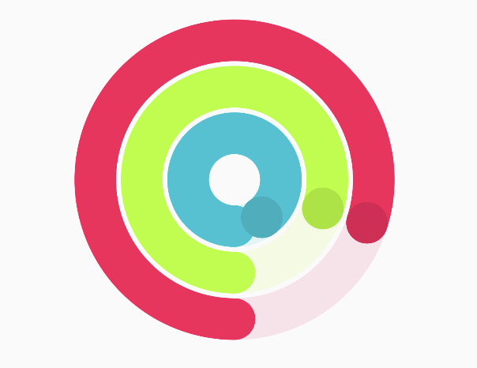

# Circle Chart



## 🍸Overview
A customizable and interactive circle chart (like Apple tracking) used for visualizing proportions or segments of a dataset.

## 📦 Package

```kotlin
import com.himanshoe.charty.circle
```

## 🧱 Declaration

```kotlin
@Composable
fun CircleChart(
    data: () -> List<CircleData>,
    modifier: Modifier = Modifier,
    circleChartConfig: CircleChartConfig = CircleChartConfig.default(),
    onCircleClick: (CircleData) -> Unit = {}
)
```

## 🔧 Parameters
| Parameter           | Type                     | Description                                                                                                                                 |
|---------------------|--------------------------|---------------------------------------------------------------------------------------------------------------------------------------------|
| `data`              | `() -> List<CircleData>` | A lambda returning the list of `CircleData` objects to be displayed in the chart. Each data entry defines a segment's value and appearance. |
| `modifier`          | `Modifier`               | Optional Compose `Modifier` to customize layout, size, padding, alignment, etc.                                                             |
| `circleChartConfig` | `CircleChartConfig`      | Chart appearance and layout configuration (e.g. stroke width, spacing, animation, inner radius). Defaults to `CircleChartConfig.default()`. |
| `onCircleClick`     | `(CircleData) -> Unit`   | Lambda that is invoked when a segment of the chart is clicked. Provides the corresponding `CircleData` item. Default is a no-op.            |


## 🧮 CircleData Model

```kotlin
data class CircleData(
    val value: Float,
    val color: ChartColor,
    val trackColor: ChartColor = color.value.fastMap { it.copy(alpha = 0.5F) }.asGradientChartColor(),
    val label: String,
)
```
| Property     | Type         | Description                                                                                                                                                                                                                     |
|--------------|--------------|---------------------------------------------------------------------------------------------------------------------------------------------------------------------------------------------------------------------------------|
| `value`      | `Float`      | The numeric value representing the size of the slice. This value is used to calculate the angle of the slice relative to the sum of all values.                                                                                 |
| `color`      | `ChartColor` | The main color used to fill the slice. Should be visually distinct for each segment.                                                                                                                                            |
| `trackColor` | `ChartColor` | A secondary, typically lighter or semi-transparent version of the main color. It can be used for rendering background rings, shadows, or hover states. Defaults to a gradient based on the main color with reduced alpha (50%). |
| `label`      | `String`     | The label or description of the slice. Useful for legends or tooltips.                                                                                                                                                          |


> You can find a mock implementation in sample module's App file

## Example Usage

```kotlin
val chartItems = listOf(
    CircleData(value = 40f, label = "Food", color = Color.Red.asSolidChartColor()),
    CircleData(value = 30f, label = "Transport", color = Color.Blue.asSolidChartColor()),
    CircleData(value = 30f, label = "Others", color = Color.Green.asSolidChartColor())
)

CircleChart(
    data = { chartItems },
    modifier = Modifier.size(200.dp),
    onCircleClick = { segment ->
        println("Clicked on: ${segment.label} (${segment.value})")
    }
)

```