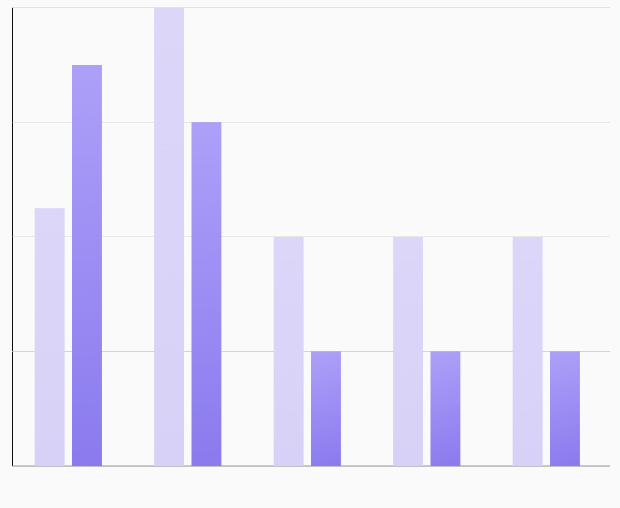

# `ComparisonBarChart`



A chart that displays a **grouped bar chart** for comparing multiple values across common categories (e.g., monthly comparisons for different products, users, or metrics). Each group represents a category and contains multiple bars to compare distinct values within that group.

## 🧱 Declaration

```kotlin
@Composable
fun ComparisonBarChart(
    data: () -> List<ComparisonBarData>,
    modifier: Modifier = Modifier,
    labelConfig: LabelConfig = LabelConfig.default(),
    comparisonBarChartConfig: ComparisonBarChartConfig = ComparisonBarChartConfig.default(),
    onGroupClicked: (Int) -> Unit = {}
)
```

## 🔧 Parameters

| Parameter                  | Type                            | Description                                                                                                                                  |
|----------------------------|---------------------------------|----------------------------------------------------------------------------------------------------------------------------------------------|
| `data`                     | `() -> List<ComparisonBarData>` | A lambda that returns a list of `ComparisonBarData` items. Each item defines a group with one or more bars for comparison.                   |
| `modifier`                 | `Modifier`                      | Compose `Modifier` to control layout, padding, size, or drawing behavior.                                                                    |
| `labelConfig`              | `LabelConfig`                   | Configuration for the X-axis and Y-axis labels, including font size, color, alignment, etc.                                                  |
| `comparisonBarChartConfig` | `ComparisonBarChartConfig`      | Defines visual properties and behavior of the grouped bar chart like bar spacing, animation, alignment, max value, etc.                      |
| `onGroupClicked`           | `(Int) -> Unit`                 | Callback triggered when a group (set of bars) is clicked. Receives the index of the clicked group. Useful for interactivity or detail views. |

---

## 📊 `ComparisonBarData` Model

A data class representing a single group in a comparison bar chart. Each group corresponds to a label (e.g., a category or time period) and contains multiple bars with individual values and colors for comparison within that group.

```kotlin
data class ComparisonBarData(
    val label: String,
    val bars: List<Float>,
    val colors: List<ChartColor>
)
```
| Property | Type               | Description                                                                                                                                                       |
|----------|--------------------|-------------------------------------------------------------------------------------------------------------------------------------------------------------------|
| `label`  | `String`           | The label representing the group on the X-axis. Common examples include month names, category names, or dates.                                                    |
| `bars`   | `List<Float>`      | A list of `Float` values representing the height of each bar in the group. The number of values in this list determines how many bars are shown for the group.    |
| `colors` | `List<ChartColor>` | A list of `ChartColor` values that define the fill color for each corresponding bar in the `bars` list. Should match the size of `bars` for consistent rendering. |

## 💡 Example

```kotlin
val chartData = listOf(
    ComparisonBarData(
        label = "Jan",
        bars = listOf(
            BarData(yValue = 50f, xValue = "Product A", barColor = Color.Red.asSolidChartColor()),
            BarData(yValue = 75f, xValue = "Product B", barColor = Color.Blue.asSolidChartColor())
        )
    ),
    ComparisonBarData(
        label = "Feb",
        bars = listOf(
            BarData(yValue = 60f, xValue = "Product A", barColor = Color.Red.asSolidChartColor()),
            BarData(yValue = 85f, xValue = "Product B", barColor = Color.Blue.asSolidChartColor())
        )
    )
)

ComparisonBarChart(
    data = { chartData },
    modifier = Modifier.fillMaxWidth(),
    onGroupClicked = { index ->
        
    }
)
```