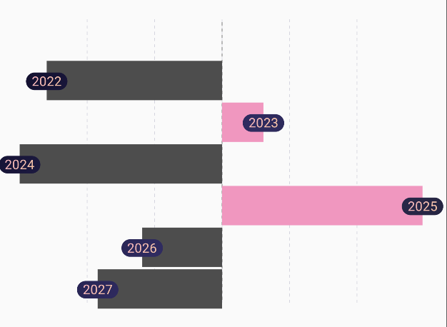
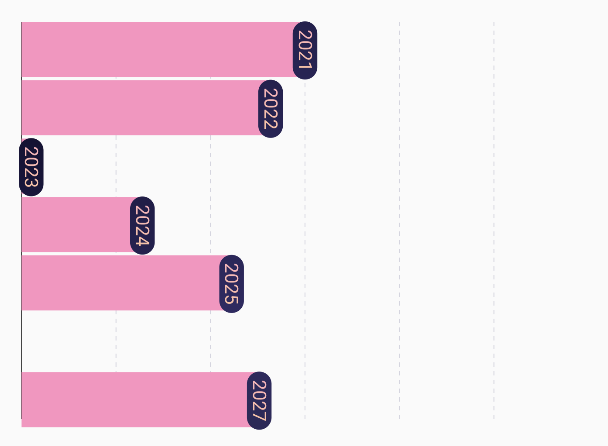

# `HorizontalBarChart`

|  |  | 
|-------------------------------------------------------------------|-------------------------------------------------------------------|

## 🍸Overview
A chart that displays a **horizontal bar chart**, where each bar extends horizontally based on its
data value. This layout is ideal when category labels are long or when you want to emphasize value
comparisons along a vertical list.

## 🧱 Declaration

```kotlin
@Composable
fun HorizontalBarChart(
    data: () -> List<BarData>,
    modifier: Modifier = Modifier,
    barChartConfig: BarChartConfig = BarChartConfig.default(),
    barChartColorConfig: BarChartColorConfig = BarChartColorConfig.default(),
    horizontalBarLabelConfig: HorizontalBarLabelConfig = HorizontalBarLabelConfig.default(),
    onBarClick: (BarData) -> Unit = {}
)
```

## 🔧 Parameters

| Parameter                  | Type                       | Description                                                                                                                                                       |
|----------------------------|----------------------------|-------------------------------------------------------------------------------------------------------------------------------------------------------------------|
| `data`                     | `() -> List<BarData>`      | A lambda that returns the list of `BarData` entries to be displayed as horizontal bars. Each `BarData` contains the Y-value (bar length) and X-value (label/key). |
| `modifier`                 | `Modifier`                 | Compose `Modifier` for layout control, sizing, padding, or other UI decorations.                                                                                  |
| `barChartConfig`           | `BarChartConfig`           | Configuration object for chart behavior and layout — such as minimum number of bars, axis and grid visibility, animation, and spacing.                            |
| `barChartColorConfig`      | `BarChartColorConfig`      | Defines color-related customization for bars, axis lines, grid lines, and background.                                                                             |
| `horizontalBarLabelConfig` | `HorizontalBarLabelConfig` | Styling and layout configuration for the labels displayed alongside the horizontal bars, such as text color, size, alignment, and optional background.            |
| `onBarClick`               | `(BarData) -> Unit`        | Callback function invoked when a bar is clicked. Receives the corresponding `BarData` item for further action (e.g., navigation, tooltip, etc.).                  |

## 📊 Data Model

Each bar is represented using the `BarData` class:

```kotlin
data class BarData(
    val yValue: Float,
    val xValue: Any,
    val barColor: ChartColor = Color.Unspecified.asSolidChartColor(),
    val barBackgroundColor: ChartColor = Color(0x40D3D3D3).asSolidChartColor(),
)
```

## 🔠 HorizontalBarLabelConfig

The horizontalBarLabelConfig parameter lets you customize how the labels for each horizontal bar are
rendered.

```kotlin
data class HorizontalBarLabelConfig(
    val showLabel: Boolean,
    val hasOverlappingLabel: Boolean,
    val textColor: ChartColor,
    val textBackgroundColors: ChartColor,
    val xAxisCharCount: Int?,
    val labelTextStyle: TextStyle?,
)
```

> If labels are not shown, users can drag their finger or scroll across the chart to reveal labels
> dynamically via gesture detection. This allows clean visualizations by default, but still gives
> access to detailed information on demand.

| Property               | Type         | Description                                                                                                                                                      |
|------------------------|--------------|------------------------------------------------------------------------------------------------------------------------------------------------------------------|
| `showLabel`            | `Boolean`    | Determines whether the label for each horizontal bar should be shown by default. If `false`, labels are hidden unless revealed through gestures (e.g. dragging). |
| `hasOverlappingLabel`  | `Boolean`    | Indicates whether labels are allowed to overlap with each other. If `true`, labels may render over each other in dense datasets.                                 |
| `textColor`            | `ChartColor` | The color of the label text. You can use solid or gradient chart colors.                                                                                         |
| `textBackgroundColors` | `ChartColor` | Background color behind the label text. Useful for adding contrast or highlighting the label.                                                                    |
| `xAxisCharCount`       | `Int?`       | Optionally limits the number of characters shown from the X-axis label. Useful for truncation in narrow layouts. If `null`, no truncation is applied.            |
| `labelTextStyle`       | `TextStyle?` | Custom styling for label text (e.g., font size, weight, family, line height). If `null`, defaults are used.                                                      |

## 💡 Example Usage

```kotlin
val performanceData = listOf(
    BarData(yValue = 80f, xValue = "Alice"),
    BarData(yValue = 65f, xValue = "Bob"),
    BarData(yValue = 90f, xValue = "Charlie")
)

HorizontalBarChart(
    data = { performanceData },
    modifier = Modifier.fillMaxWidth(),
    onBarClick = { bar ->
        println("Clicked on ${bar.xValue} with value ${bar.yValue}")
    }
)
```
