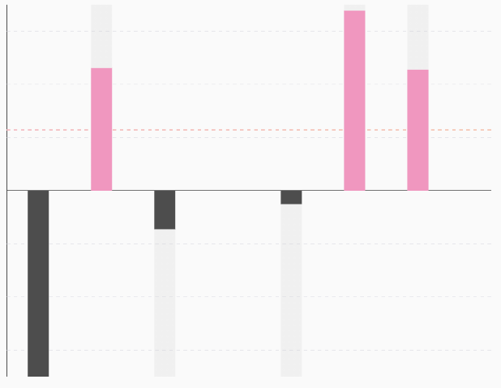

# LineBarChart



## 🍸Overview
A chart that displays a bar chart with an optional target line overlaid. This chart is useful for showing individual bar values while highlighting a specific target or benchmark using a line (e.g., sales goal, average, or threshold).

## 🧱 Declaration

```kotlin
@Composable
fun LineBarChart(
    data: () -> List<BarData>,
    modifier: Modifier = Modifier,
    target: Float? = null,
    targetConfig: TargetConfig = TargetConfig.default(),
    barChartConfig: BarChartConfig = BarChartConfig.default(),
    labelConfig: LabelConfig = LabelConfig.default(),
    barChartColorConfig: BarChartColorConfig = BarChartColorConfig.default(),
    onBarClick: (Int, BarData) -> Unit = { _, _ -> },
)
```

## 🔧 Parameters
| Parameter             | Type                     | Description                                                                                                                  |
|-----------------------|--------------------------|------------------------------------------------------------------------------------------------------------------------------|
| `data`                | `() -> List<BarData>`    | A lambda function returning the list of bar values to render. Each `BarData` contains the value, label, and color of a bar.  |
| `modifier`            | `Modifier`               | A Jetpack Compose `Modifier` to customize layout, size, padding, etc.                                                        |
| `target`              | `Float?`                 | A numerical value representing a target line to be drawn across the chart. If `null`, no target line is shown.               |
| `targetConfig`        | `TargetConfig`           | Configuration object to style and position the target line (e.g., stroke color, width, label).                               |
| `barChartConfig`      | `BarChartConfig`         | Controls the layout behavior of the chart including min bar count, animation, axis visibility, and spacing.                  |
| `labelConfig`         | `LabelConfig`            | Configuration for customizing the bar labels (position, visibility, text style).                                             |
| `barChartColorConfig` | `BarChartColorConfig`    | Defines the colors for bars, axis lines, grid lines, and backgrounds.                                                        |
| `onBarClick`          | `(Int, BarData) -> Unit` | Lambda called when a user taps on a bar. Provides the index and associated `BarData`. Useful for interactivity and tooltips. |

## 📊 Data Model

```kotlin
data class BarData(
    val yValue: Float,
    val xValue: Any,
    val barColor: ChartColor = Color.Unspecified.asSolidChartColor(),
    val barBackgroundColor: ChartColor = Color(0x40D3D3D3).asSolidChartColor(),
)
```

## 🔠 Target
- Use the target parameter to draw a horizontal reference line across the chart.
- Ideal for benchmarks, goals, or thresholds (e.g., expected sales, performance targets).
- Styled using TargetConfig, which allows customizing:
    - Color and stroke width
    - Dashed/solid appearance
    - Label and label positioning

## 💡 Example Usage

```kotlin
LineBarChart(
    data = {
        listOf(
            BarData(80f, "Jan"),
            BarData(120f, "Feb"),
            BarData(60f, "Mar")
        )
    },
    target = 100f,
    targetConfig = TargetConfig(
        color = Color.Red,
        strokeWidth = 2.dp,
        showLabel = true,
        label = "Target: 100"
    ),
    onBarClick = { index, bar ->
        println("Bar ${index + 1}: ${bar.yValue}")
    }
)

```