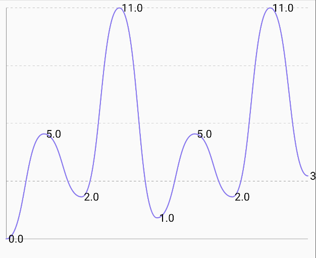
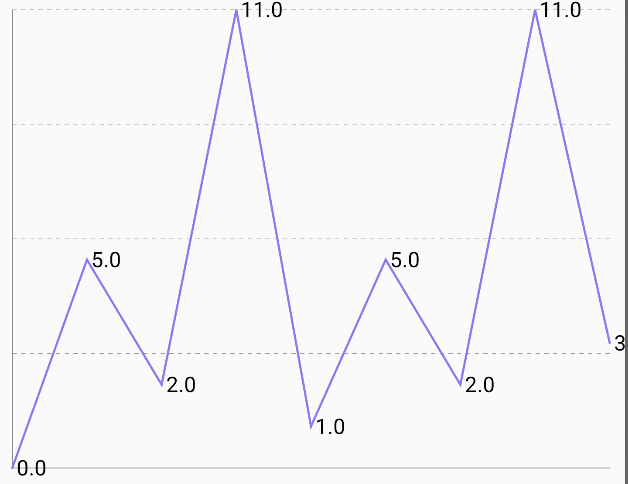
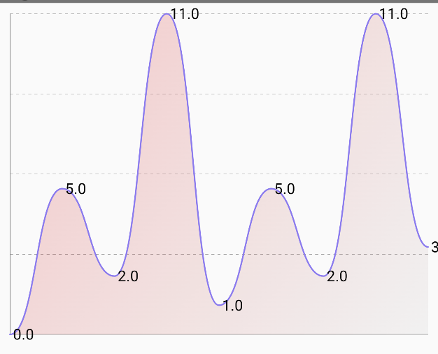

# `LineChart`

| Smooth Line Curve                                      | Pointed Line Curve                                     | Line Filled                                            |
|--------------------------------------------------------|--------------------------------------------------------|--------------------------------------------------------|
|  |  |  |

## 🍸Overview

A chart that renders a **line chart** to visualize continuous or time-series data. Supports various
configurations including smooth curves, area fill, stroke lines, interactivity, and targets.

---

## 🧱 Declaration

There are **two overloaded versions** of `LineChart`, each offering different forms of interaction:

### Version 1: With `onClick` support

```kotlin
@Composable
fun LineChart(
    data: () -> List<LineData>,
    modifier: Modifier = Modifier,
    smoothLineCurve: Boolean = true,
    showFilledArea: Boolean = false,
    showLineStroke: Boolean = true,
    showOnClickBar: Boolean = true,
    colorConfig: LineChartColorConfig = LineChartColorConfig.default(),
    labelConfig: LabelConfig = LabelConfig.default(),
    target: Float? = null,
    targetConfig: TargetConfig = TargetConfig.default(),
    chartConfig: LineChartConfig = LineChartConfig(),
    onClick: (LineData) -> Unit = {}
)
```

### Version 2: With `onValueChange` support

```kotlin
@Composable
fun LineChart(
    data: () -> List<LineData>,
    modifier: Modifier = Modifier,
    smoothLineCurve: Boolean = true,
    showFilledArea: Boolean = false,
    showLineStroke: Boolean = true,
    colorConfig: LineChartColorConfig = LineChartColorConfig.default(),
    labelConfig: LabelConfig = LabelConfig.default(),
    target: Float? = null,
    targetConfig: TargetConfig = TargetConfig.default(),
    chartConfig: LineChartConfig = LineChartConfig(),
    onValueChange: (LineData) -> Unit = {},
)
```

---

## 🔧 Parameters

| Parameter         | Type                   | Description                                                                                                                          |
|-------------------|------------------------|--------------------------------------------------------------------------------------------------------------------------------------|
| `data`            | `() -> List<LineData>` | Lambda returning a list of `LineData` points representing x/y values to be plotted.                                                  |
| `modifier`        | `Modifier`             | Optional Jetpack Compose modifier for layout styling.                                                                                |
| `smoothLineCurve` | `Boolean`              | If true, curves between data points will be smoothly interpolated using Bézier or spline curves. If false, straight lines are drawn. |
| `showFilledArea`  | `Boolean`              | If true, the area under the line is filled with gradient or solid color.                                                             |
| `showLineStroke`  | `Boolean`              | If true, a visible line is drawn over the chart representing the data.                                                               |
| `showOnClickBar`  | `Boolean`              | (Only in version 1) If true, shows a vertical indicator when a value is clicked.                                                     |
| `colorConfig`     | `LineChartColorConfig` | Defines line stroke color, fill color, gradients, and background.                                                                    |
| `labelConfig`     | `LabelConfig`          | Manages display and styling of axis or data labels.                                                                                  |
| `target`          | `Float?`               | Optional horizontal line to show a benchmark or target.                                                                              |
| `targetConfig`    | `TargetConfig`         | Configuration of the target line (color, thickness, label, etc).                                                                     |
| `chartConfig`     | `LineChartConfig`      | Controls axis visibility, padding, animation, min/max values, etc.                                                                   |
| `onClick`         | `(LineData) -> Unit`   | (Only in version 1) Triggered when a data point is clicked.                                                                          |
| `onValueChange`   | `(LineData) -> Unit`   | (Only in version 2) Triggered on drag interactions over the line chart.                                                              |

---

## ⚠️ Constraints

```kotlin
require(showFilledArea || showLineStroke) {
    "Both showFilledArea and showLineStroke cannot be false at the same time"
}
```

At least one of `showFilledArea` or `showLineStroke` **must** be true, otherwise an
`IllegalArgumentException` is thrown. This ensures the chart is visible.

---

## 📊 Data Model

Each data point in the chart is represented by the `LineData` class:

```kotlin
data class LineData(
    val xValue: Any,
    val yValue: Float
)
```

---

## 💡 Example Usage

```kotlin
LineChart(
    data = {
        listOf(
            LineData("Jan", 10f),
            LineData("Feb", 40f),
            LineData("Mar", 25f)
        )
    },
    smoothLineCurve = true,
    showFilledArea = true,
    showLineStroke = true,
    target = 30f,
    targetConfig = TargetConfig(label = "Average"),
    onClick = { lineData -> println("Clicked: ${lineData.xValue} -> ${lineData.yValue}") }
)
```