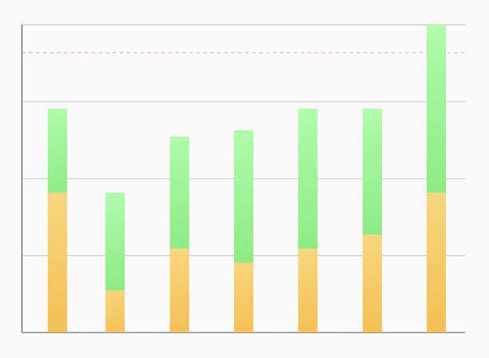

# Line Stacked Bar Chart



## 🍸Overview
The `LineStackedBarChart` offers a unique way to visualize stacked data. It's a variation of a standard stacked bar chart, but instead of wider bars, each stack is rendered as a thin vertical line composed of multiple segments. This chart is suitable for showing part-to-whole relationships across multiple categories, with a visually lighter footprint than a standard `StackedBarChart`.

## 🧱 Declaration
```kotlin
@Composable
fun LineStackedBarChart(
    data: () -> List<StackBarData>,
    modifier: Modifier = Modifier,
    target: Float? = null,
    targetConfig: TargetConfig = TargetConfig.default(),
    stackBarConfig: StackBarConfig = StackBarConfig.default(),
    labelConfig: LabelConfig = LabelConfig.default(),
    barChartColorConfig: BarChartColorConfig = BarChartColorConfig.default(),
    onBarClick: (Int, StackBarData) -> Unit = { _, _ -> }
)
```

## 🔧 Parameters
| Parameter             | Type                          | Description                                                                                                                                                              |
|-----------------------|-------------------------------|--------------------------------------------------------------------------------------------------------------------------------------------------------------------------|
| `data`                | `() -> List<StackBarData>`    | A lambda function that returns a list of `StackBarData`. Each `StackBarData` object represents a full vertical "line" stack.                                            |
| `modifier`            | `Modifier`                    | A `Modifier` for customizing the layout (e.g., size, padding) of the chart. (Optional)                                                                                   |
| `target`              | `Float?`                      | An optional `Float` value. If provided, a horizontal line will be drawn at this Y-value on the chart. (Optional)                                                          |
| `targetConfig`        | `TargetConfig`                | A `TargetConfig` object for configuring the appearance of the target line. (Optional, defaults to `TargetConfig.default()`)                                             |
| `stackBarConfig`      | `StackBarConfig`              | A `StackBarConfig` object for configuring chart aspects. Key properties include `showCurvedBar`, `showAxisLines`, `showGridLines`, `minimumBarCount`. (Optional, defaults to `StackBarConfig.default()`) |
| `labelConfig`         | `LabelConfig`                 | A `LabelConfig` object for configuring the appearance of X-axis and Y-axis labels. (Optional, defaults to `LabelConfig.default()`)                                   |
| `barChartColorConfig` | `BarChartColorConfig`         | A `BarChartColorConfig` object used here primarily for configuring the colors of axis lines and grid lines. The colors for the stack segments themselves are defined within each `StackBarData` item. (Optional, defaults to `BarChartColorConfig.default()`) |
| `onBarClick`          | `(Int, StackBarData) -> Unit` | A lambda function `(Int, StackBarData) -> Unit` that is invoked when a "line" stack is clicked. It receives the index of the clicked stack and the corresponding `StackBarData`. (Optional) |

## 🧮 StackBarData Model

```kotlin
data class StackBarData(
    val label: String,
    val values: List<Float>,
    val colors: List<ChartColor>
)
```
| Property | Type                | Description                                                                                                                                                              |
|----------|---------------------|--------------------------------------------------------------------------------------------------------------------------------------------------------------------------|
| `label`  | `String`            | The label for this stack, displayed on the X-axis.                                                                                                                       |
| `values` | `List<Float>`       | A list of float values, where each value is a segment in the stack. The height of each segment is proportional to its value relative to the total sum of values in this stack. |
| `colors` | `List<ChartColor>`  | A list of `ChartColor` for each corresponding segment in `values`. The size of this list should match the `values` list.                                                 |

> You can find a mock implementation in sample module's App file

## Example Usage
```kotlin
@Composable
fun SampleLineStackedBarChart() {
  LineStackedBarChart(
    data = { data },
    target = 100f,
    modifier = Modifier.fillMaxWidth().height(300.dp).padding(24.dp)
  )
}
```