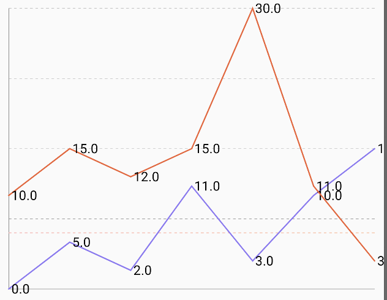
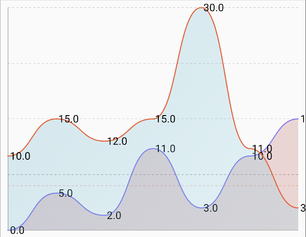

# Multi Line Chart

| Pointed Line Curve                                             | Smooth Line Curve                                              | 
|----------------------------------------------------------------|----------------------------------------------------------------|
|  |  |

## 🍸Overview

A multi-line chart displays multiple series of data points connected by lines. It is particularly
useful for comparing trends over time or across different categories for several groups
simultaneously. This chart allows for easy visualization of relationships, crossovers, and
divergences between different datasets.

## 🧱 Declaration

```kotlin
@Composable
fun MultiLineChart(
    lines: () -> List<LineData>,
    modifier: Modifier = Modifier,
    lineConfig: LineConfig = LineConfig.default(),
    xAxisConfig: XAxisConfig = XAxisConfig.default(),
    yAxisConfig: YAxisConfig = YAxisConfig.default(),
    labelConfig: LabelConfig = LabelConfig.default(),
    onPointClick: (lineIndex: Int, pointIndex: Int, point: PointData) -> Unit = { _, _, _ -> }
)
```

## 🔧 Parameters

| Parameter      | Type                                                          | Description                                                                                                                                                                                                          |
|----------------|---------------------------------------------------------------|----------------------------------------------------------------------------------------------------------------------------------------------------------------------------------------------------------------------|
| `lines`        | `() -> List<LineData>`                                        | A lambda returning the list of `LineData` entries. Each `LineData` defines a separate line with its data points, color, and other properties.                                                                        |
| `modifier`     | `Modifier`                                                    | Optional Compose `Modifier` for layout behavior, styling, padding, etc.                                                                                                                                              |
| `lineConfig`   | `LineConfig`                                                  | Configuration for the appearance of all lines, such as default point visibility, point style, line thickness, and curve rendering (e.g., cubic bezier). Individual `LineData` properties can override some of these. |
| `xAxisConfig`  | `XAxisConfig`                                                 | Configuration specific to the X-axis, like label formatting, grid lines, and axis line visibility.                                                                                                                   |
| `yAxisConfig`  | `YAxisConfig`                                                 | Configuration specific to the Y-axis, including label formatting, value range, grid lines, and axis line visibility.                                                                                                 |
| `labelConfig`  | `LabelConfig`                                                 | Controls how labels for X and Y axes are rendered (font size, visibility, position, color etc.).                                                                                                                     |
| `onPointClick` | `(lineIndex: Int, pointIndex: Int, point: PointData) -> Unit` | Lambda called when a data point on a line is clicked. Provides indices for the line and point, and the `PointData` itself. Default is no-op.                                                                         |

## 🧮 Data Models

### MultiLineData Model

 ```kotlin
data class MultiLineData(
    val data: List<LineData>,
    val colorConfig: LineChartColorConfig
)
```

| Parameter     | Type                   | Description                                                                                        |
|---------------|------------------------|----------------------------------------------------------------------------------------------------|
| `data`        | `List<LineData>`       | A list of `LineData` points representing the values to be plotted for this line.                   |
| `colorConfig` | `LineChartColorConfig` | The color and styling configuration specific to this line, including stroke, fill, gradients, etc. |

> You can find a mock implementation in sample module's App file

## Example Usage

```kotlin
@Composable
fun SampleMultiLineChart() {
    MultiLineChart(
        modifier = Modifier.fillMaxWidth().height(300.dp).padding(16.dp),
        lines = { chartLinesData },
        labelConfig = LabelConfig.default().copy(
            showXLabel = true,
            showYLabel = true
        ),
        lineConfig = LineConfig.default().copy(
            showPoints = true
        ),
        onPointClick = { lineIndex, pointIndex, point ->   }
    )
}
```