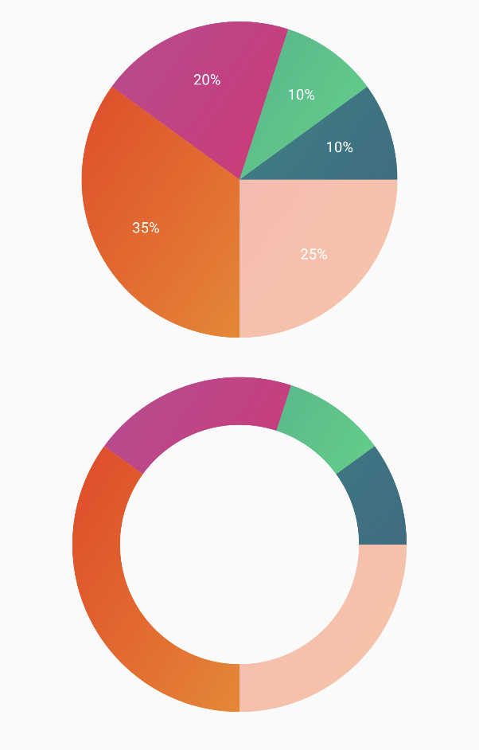

# PieChart

| Pointed Line Curve                                  |  
|-----------------------------------------------------|
|  |

## 🍸Overview

This function displays a Pie Chart using a list of PieChartData slices. It supports rendering either a standard pie chart or a donut-style chart (with a hole in the center). Each slice is interactive and can trigger a click callback.

## 🧱 Declaration

```kotlin
@Composable
fun PieChart(
    data: () -> List<PieChartData>,
    modifier: Modifier = Modifier,
    isDonutChart: Boolean = false,
    onPieChartSliceClick: (PieChartData) -> Unit = {}
)
```
> isDonutChart is used to make donut of PieChart

## 🔧 Parameters

| Parameter              | Type                       | Description                                                                                                                                               |
|------------------------|----------------------------|-----------------------------------------------------------------------------------------------------------------------------------------------------------|
| `data`                 | `() -> List<PieChartData>` | A lambda that returns the list of pie slices to display. Each slice is represented by a `PieChartData` object.                                            |
| `modifier`             | `Modifier`                 | A `Modifier` for customizing the layout and appearance of the chart (e.g., size, padding, etc.).                                                          |
| `isDonutChart`         | `Boolean`                  | If `true`, the chart is displayed as a **donut** (with a circular center cut out). Default is `false` for a full pie.                                     |
| `onPieChartSliceClick` | `(PieChartData) -> Unit`   | Callback invoked when a slice is clicked, providing the clicked `PieChartData` as a parameter. Useful for interactivity like tooltips or data inspection. |

## 🧮 PieChartData Model

```kotlin
data class PieChartData(
    val value: Float,
    val color: ChartColor,
    val labelColor: ChartColor = Color.White.asSolidChartColor(),
    val label: String,
)
```

| Parameter    | Type         | Description                                                                                 |
|--------------|--------------|---------------------------------------------------------------------------------------------|
| `value`      | `Float`      | The numeric value of the slice. This determines the size (angle) of the slice in the chart. |
| `color`      | `ChartColor` | The fill color of the slice. Can be solid or gradient depending on implementation.          |
| `labelColor` | `ChartColor` | The color of the text label associated with the slice. Defaults to white (`Color.White`).   |
| `label`      | `String`     | The textual label to display for the slice. Typically shown in or near the slice.           |

> You can find a mock implementation in sample module's App file

## Example Usage

```kotlin
@Composable
fun SamplePieChart() {
    PieChart(
        data = { samplePieData },
        isDonutChart = true,
        onPieChartSliceClick = { slice -> println("Clicked: ${slice.label}") },
        modifier = Modifier.size(200.dp)
    )
}
```