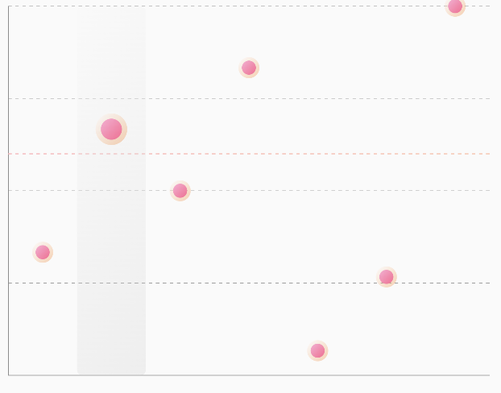

# `PointChart`

| Point Chart Preview                                       |                  
|-----------------------------------------------------------|
|  | 

## 🍸Overview
Renders a point chart where each data point is plotted on a 2D axis, useful for visualizing discrete
data points without connecting lines.

---

## 🧱 Declaration

```kotlin
@Composable
fun PointChart(
    data: () -> List<PointData>,
    modifier: Modifier = Modifier,
    labelConfig: LabelConfig = LabelConfig.default(),
    colorConfig: PointChartColorConfig = PointChartColorConfig.default(),
    chartConfig: PointChartConfig = PointChartConfig(),
    target: Float? = null,
    targetConfig: TargetConfig = TargetConfig.default(),
    onPointClick: (Int, PointData) -> Unit = { _, _ -> }
)
```

## 🔧 Parameters

| Parameter      | Type                       | Description                                                                                                            |
|----------------|----------------------------|------------------------------------------------------------------------------------------------------------------------|
| `data`         | `() -> List<PointData>`    | Lambda returning the list of data points to plot. Each `PointData` contains the position and optional visual settings. |
| `modifier`     | `Modifier`                 | Modifier to control layout, size, and gestures.                                                                        |
| `labelConfig`  | `LabelConfig`              | Configuration for axis labels and styling.                                                                             |
| `colorConfig`  | `PointChartColorConfig`    | Defines color configuration for points, axes, and grid.                                                                |
| `chartConfig`  | `PointChartConfig`         | Visual and animation configuration for the chart (see below).                                                          |
| `target`       | `Float?`                   | Optional target line (e.g. goal threshold) shown on the chart.                                                         |
| `targetConfig` | `TargetConfig`             | Styling for the optional target line.                                                                                  |
| `onPointClick` | `(Int, PointData) -> Unit` | Callback when a point is tapped. Provides index and data point.                                                        |

---

## 📊 Data Model

### PointData

Each data point in the chart is represented by the `PointData` class:

```kotlin
data class PointData(
    val yValue: Float,
    val xValue: Any,
)
```

### ⚙️ PointChartConfig

Configuration options for customizing the appearance and animation of a PointChart.

```kotlin
data class PointChartConfig(
    val axisLineWidth: Float = 2f,
    val gridLineWidth: Float = 1f,
    val circleRadius: Float = 10f,
    val showClickedBar: Boolean = true,
    val animationDurationMillis: Int = 500,
    val animationEasing: Easing = LinearEasing,
    val animatePoints: Boolean = true,
    val gridLinePathEffect: PathEffect = PathEffect.dashPathEffect(floatArrayOf(10f, 10f), 0f),
)
```

| Parameter                 | Type         | Description                                                       |
|---------------------------|--------------|-------------------------------------------------------------------|
| `axisLineWidth`           | `Float`      | Width of the X and Y axis lines.                                  |
| `gridLineWidth`           | `Float`      | Width of the horizontal/vertical grid lines.                      |
| `circleRadius`            | `Float`      | Radius of each plotted point on the chart.                        |
| `showClickedBar`          | `Boolean`    | Whether to visually highlight the selected/clicked point.         |
| `animationDurationMillis` | `Int`        | Duration of the entry animation for points.                       |
| `animationEasing`         | `Easing`     | The easing function used during animation.                        |
| `animatePoints`           | `Boolean`    | If true, points animate when the chart is first drawn.            |
| `gridLinePathEffect`      | `PathEffect` | The pattern used for drawing grid lines, default is dashed lines. |

---

## 💡 Example Usage

```kotlin
PointChart(
    data = { data },
    target = 18f,
    colorConfig = PointChartColorConfig.default(),
    chartConfig = PointChartConfig(circleRadius = 20F),
    modifier = Modifier.padding(10.dp).fillMaxWidth().height(300.dp),
    onPointClick = { index, circleData -> }
)
```