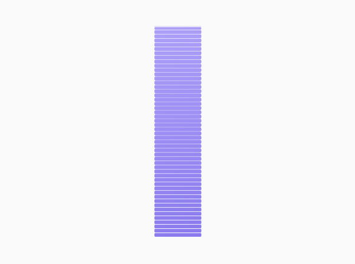

## 📶 `SignalProgressBarChart`



## 🍸Overview
A simple **signal-style bar chart** that displays progress using vertically stacked blocks. Visually resembles mobile network signal indicators.

## 🧱 Declaration
```kotlin
@Composable
fun SignalProgressBarChart(
    progress: () -> Float,
    maxProgress: Float = 100F,
    modifier: Modifier = Modifier,
    totalBlocks: Int = 10,
    trackColor: ChartColor = Color.Gray.asSolidChartColor(),
    progressColor: ChartColor = Color.Green.asSolidChartColor(),
    gapRatio: Float = 0.1F
)
```

---

### 🔧 Parameters

| Parameter | Type | Description |
| --- | --- | --- |
| `progress` | `() -> Float` | Lambda returning the current progress value. |
| `maxProgress` | `Float` | Maximum possible progress. Default is `100f`. |
| `modifier` | `Modifier` | Modifier to customize layout, size, gesture, etc. |
| `totalBlocks` | `Int` | Total number of vertical blocks in the chart. |
| `trackColor` | `ChartColor` | Color of the unfilled (track) blocks. |
| `progressColor` | `ChartColor` | Color of the filled (progress) blocks. |
| `gapRatio` | `Float` | Fraction of space between each block relative to its height (0.1 = 10% gap). |

---

### 💡 Notes

-   The blocks fill vertically from bottom to top based on `progress / maxProgress`.
-   Useful for visual indicators such as **signal strength**, **step completion**, or **tiered progress**.
-   The `gapRatio` allows customization of spacing between blocks for a tighter or more spaced-out look.
-   You can pass a dynamic `progress` lambda to animate or update progress in real time.

---

### 📌 Example

```kotlin
SignalProgressBarChart(
    progress = { 40f },
    maxProgress = 100f,
    totalBlocks = 5,
    progressColor = Color.Blue.asSolidChartColor(),
    trackColor = Color.LightGray.asSolidChartColor(),
    gapRatio = 0.15f
)
```
