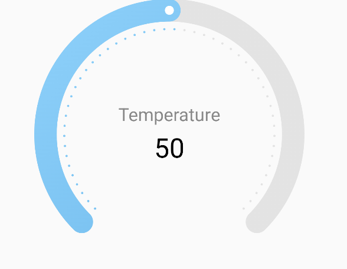

## 🧭 `SpeedometerProgressBar`



## 🍸Overview
A circular **speedometer-style progress bar** with animated progress, customizable colors, arc dots, and center text. Ideal for dashboards, gauges, or motivational UI components.

## 🧱 Declaration
```kotlin
@Composable
fun SpeedometerProgressBar(
    progress: () -> Float,
    title: String,
    color: ChartColor,
    progressIndicatorColor: ChartColor,
    trackColor: ChartColor,
    modifier: Modifier = Modifier,
    dotConfig: DotConfig = DotConfig.default(),
    titleTextConfig: TextConfig = TextConfig.default(),
    subTitleTextConfig: TextConfig = TextConfig.default(fontSize = 20.sp),
)
```

---

### 🔧 Parameters

| Parameter | Type | Description |
| --- | --- | --- |
| `progress` | `() -> Float` | Lambda returning progress between `0f` and `1f`. |
| `title` | `String` | Text shown at the center of the speedometer. |
| `color` | `ChartColor` | Color of the progress arc. |
| `progressIndicatorColor` | `ChartColor` | Color of the indicator circle on the arc. |
| `trackColor` | `ChartColor` | Color of the background arc (track). |
| `modifier` | `Modifier` | Modifier for size, padding, and gesture handling. |
| `dotConfig` | `DotConfig` | Configuration for arc dots (size, count, spacing). |
| `titleTextConfig` | `TextConfig` | Typography for the main title text. |
| `subTitleTextConfig` | `TextConfig` | Typography for optional subtitle or progress info. |

---

### ✨ Features

-   🌀 Smooth animated arc indicating progress.
-   🟢 Optional indicator dot moves with progress.
-   🔘 Decorative dots along the arc using `DotConfig`.
-   🔤 Centered title + subtitle text using `TextConfig`.
-   🔄 Fully customizable using modifiers and color configs.


---

### 📌 Example

```kotlin
SpeedometerProgressBar(
    progress = { 0.65f },
    title = "65%",
    color = Color.Green.asSolidChartColor(),
    progressIndicatorColor = Color.Black.asSolidChartColor(),
    trackColor = Color.LightGray.asSolidChartColor(),
    dotConfig = DotConfig(count = 30),
    titleTextConfig = TextConfig(fontSize = 24.sp, fontWeight = FontWeight.Bold),
    subTitleTextConfig = TextConfig(fontSize = 14.sp, color = Color.Gray)
)
```