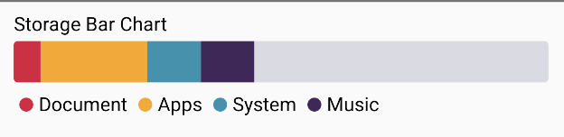

📊 StackedBarChart



## 🍸Overview
A bar that renders a horizontal storage bar, where each segment represents a portion of total usage (like memory, disk, or category breakdowns). The segments are color-coded and interactive.

## 🧱 Declaration

```kotlin
@Composable
fun StorageBar(
    data: () -> List<StorageData>,
    trackColor: ChartColor = Color(0xD3D3D3DE).asSolidChartColor(),
    modifier: Modifier = Modifier,
    onClick: (StorageData) -> Unit = {}
)
```

## 🔧 Parameters

| Parameter    | Type                      | Description                                                                            |
|--------------|---------------------------|----------------------------------------------------------------------------------------|
| `data`       | `() -> List<StorageData>` | Lambda returning a list of segments. Each segment contains a value and category info.  |
| `trackColor` | `ChartColor`              | The background track color behind all segments. Defaults to light gray.                |
| `modifier`   | `Modifier`                | Modifier for layout and styling customization.                                         |
| `onClick`    | `(StorageData) -> Unit`   | Callback triggered when a segment is tapped. Provides the corresponding `StorageData`. |

## 📊 Data Model
StorageData consists of multiple segments:

```kotlin
data class StorageData(
    val label: String,
    val value: Float,
    val color: ChartColor
)
```
- label: The category name (e.g., "Photos", "Apps").
- value: Proportional value for this segment.
- color: The color representing this category in the bar.

### ✨ Features
-   📊 Proportional segments based on total value.
-   🎨 Custom color for each segment.
-   🖱️ Interactive — tap on a segment to receive the related `StorageData`.
-   🎚️ Full-width visual indicator bar with background track color.


---

### 📌 Example

```kotlin
StorageBar(
    data = {
        listOf(
            StorageData("Photos", 40f, Color.Blue.asSolidChartColor()),
            StorageData("Apps", 30f, Color.Red.asSolidChartColor()),
            StorageData("Other", 30f, Color.Gray.asSolidChartColor())
        )
    },
    trackColor = Color.LightGray.asSolidChartColor(),
    onClick = { segment -> println("Clicked: ${segment.label}") }
)
```
