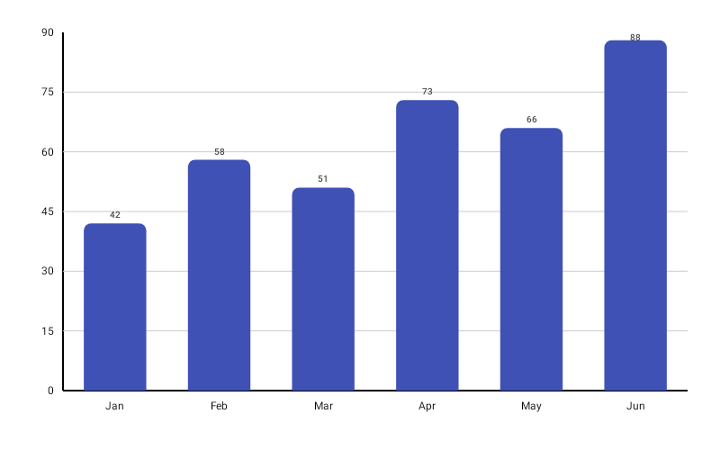

# BarChart

Best for comparing discrete values across categories with vertical bars.



```kotlin
BarChart(
    data = {
        listOf(
            BarData(label = "Mon", value = 120f),
            BarData(label = "Tue", value = 85f),
            BarData(label = "Wed", value = 200f),
            BarData(label = "Thu", value = 60f),
            BarData(label = "Fri", value = 175f),
        )
    },
    modifier = Modifier.fillMaxWidth().height(300.dp),
    color = ChartyColor.Solid(Color(0xFF6650A4)),
    barConfig = BarChartConfig(
        cornerRadius = CornerRadius.Large,
        showDataLabels = true,
        animation = Animation.Default,
    ),
    onBarClick = { barData -> println("Clicked: ${barData.label} = ${barData.value}") },
)
```

A `BarData` may carry its own `color: ChartyColor?`, which overrides the chart-level `color` for that bar.

## Corner radius

`cornerRadius` is a sealed class with presets and a custom option:

```kotlin
barConfig = BarChartConfig(cornerRadius = CornerRadius.Custom(radius = 20f))
```

`None` (0), `Small` (4), `Medium` (8, the default), `Large` (12), `ExtraLarge` (16), or `Custom(radius)` for any non-negative value.

## Data labels

```kotlin
barConfig = BarChartConfig(
    showDataLabels = true,
    dataLabelFormatter = { barData -> "${barData.value.toInt()}k" },
    dataLabelStyle = TextStyle(fontSize = 11.sp, fontWeight = FontWeight.SemiBold),
)
```

## Rolling window

`visibleWindow` keeps only the last N bars on screen; as data is appended the window slides.

```kotlin
BarChart(
    data = { throughput },
    modifier = Modifier.fillMaxWidth().height(300.dp),
    color = ChartyColor.Solid(Color(0xFF6650A4)),
    barConfig = BarChartConfig(visibleWindow = 30, animation = Animation.Fast),
)
```

It must be `null` (disabled) or at least `2`.

## Persistent markers

`markers` pins a permanent dot and callout to the top of a bar. A **negative `dataIndex` counts back from the end of the drawn data**, so `dataIndex = -1` labels the newest bar — the idiom for keeping a label on the latest value of a rolling window.


```kotlin
BarChart(
    data = { throughput },
    modifier = Modifier.fillMaxWidth().height(300.dp),
    color = ChartyColor.Solid(Color(0xFF6650A4)),
    barConfig = BarChartConfig(
        visibleWindow = 30,
        markers = listOf(PersistentMarker(dataIndex = -1, label = "Now")),
    ),
)
```

With no `label` the marker shows the bar's formatted value; markers outside the drawn range are skipped.

## Animating value changes

```kotlin
barConfig = BarChartConfig(animateValueChanges = true, animation = Animation.Fast)
```

Bars glide to their new heights when the data changes instead of jumping.

## Crosshair

`BarChart` gained a crosshair recently: a vertical guide that snaps to the nearest bar's centre as you drag. It leaves taps alone, so tapping a bar still raises its tooltip and calls `onBarClick`.

```kotlin
BarChart(
    data = { series },
    modifier = Modifier.fillMaxWidth().height(300.dp),
    color = ChartyColor.Solid(Color(0xFF6650A4)),
    crosshair = ChartCrosshair(config = ChartCrosshairConfig(showHorizontalLine = false)),
)
```

`barConfig.crosshairConfig` is the older equivalent; the `crosshair` parameter wins when both are set. Streaming scrollback does not survive a crosshair — the crosshair owns the drag.

## Tooltip

```kotlin
BarChart(
    data = { series },
    modifier = Modifier.fillMaxWidth().height(300.dp),
    color = ChartyColor.Solid(Color(0xFF6650A4)),
    tooltip = ChartTooltip.canvas(),
    barConfig = BarChartConfig(
        tooltipFormatter = { barData -> "${barData.label}: ${barData.value}" },
        tooltipPosition = TooltipPosition.ABOVE,
    ),
)
```

`ChartTooltip.canvas()` (default) draws the built-in bubble; `ChartTooltip.compose { … }` renders any composable over the selected bar; `ChartTooltip.none()` disables it.

Set `ChartInteractionConfig(dragTooltipEnabled = true)` to track the bar under the finger while dragging.

## Accessibility

The chart attaches a generated summary ("Bar chart, 5 bars. Range: … Highest: … Lowest: …") plus one focusable node per bar, so screen readers can traverse the bars one by one.

```kotlin
BarChart(
    data = { series },
    modifier = Modifier.fillMaxWidth().height(300.dp),
    color = ChartyColor.Solid(Color(0xFF6650A4)),
    interactionConfig = ChartInteractionConfig(accessibilityDescription = "Daily orders, Monday to Friday"),
)
```

Pass an empty string to suppress the summary.

## `BarChartConfig`

Shared with `HorizontalBarChart` and `SpanChart`.

| Property | Type | Default | Description |
| --- | --- | --- | --- |
| `barWidthFraction` | `Float` | `0.6f` | Bar width as a fraction of its slot; must be in `0f..1f` |
| `barSpacing` | `Float` | `0f` | Extra gap between bars; must be non-negative |
| `cornerRadius` | `CornerRadius` | `CornerRadius.Medium` | Rounding of the bar's value end |
| `negativeValuesDrawMode` | `NegativeValuesDrawMode` | `BELOW_AXIS` | `BELOW_AXIS` (bars extend past zero) or `FROM_MIN_VALUE` (baseline shifts to the minimum) |
| `animation` | `Animation` | `Animation.Default` | Grow-from-baseline entry animation |
| `animateValueChanges` | `Boolean` | `false` | Tween bar values on data change |
| `referenceLine` | `ReferenceLineConfig?` | `null` | Optional guide line |
| `referenceBand` | `ReferenceBandConfig?` | `null` | Optional shaded band (vertical `BarChart` only) |
| `markers` | `List<PersistentMarker>` | `emptyList()` | Persistent pinned labels |
| `tooltipConfig` | `TooltipConfig?` | `null` (the theme's) | Canvas tooltip appearance |
| `tooltipPosition` | `TooltipPosition` | `AUTO` | `ABOVE`, `BELOW`, or `AUTO` |
| `tooltipFormatter` | `(BarData) -> String` | `"label: value"` | Tooltip text |
| `crosshairConfig` | `ChartCrosshairConfig?` | `null` | Legacy crosshair switch; `crosshair` takes precedence |
| `showDataLabels` | `Boolean` | `false` | Draws the value at the bar's end |
| `dataLabelFormatter` | `(BarData) -> String` | whole numbers unformatted | Data label text |
| `dataLabelStyle` | `TextStyle` | 10 sp, semi-bold, dark gray | Data label style |
| `visibleWindow` | `Int?` | `null` | Rolling "show last N" window; `null` or `>= 2` |
