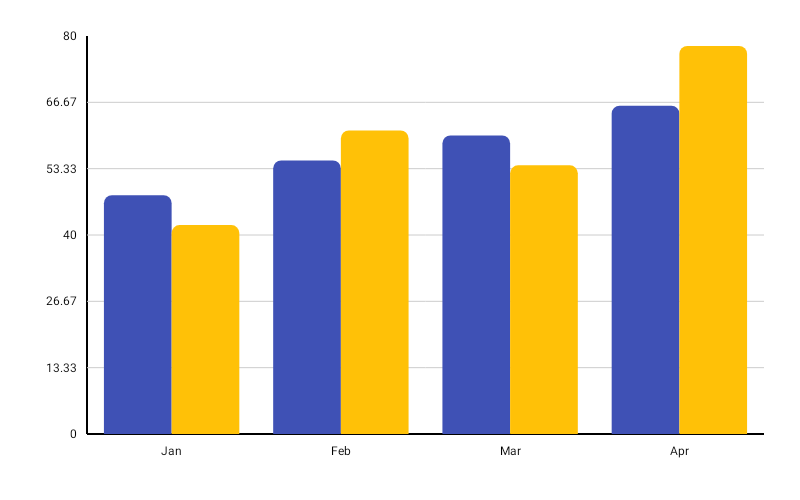

# ComparisonBarChart

Best for comparing multiple values (e.g. two metrics side by side) within the same category group — each `BarGroup` renders its values as individual bars clustered together.



```kotlin
ComparisonBarChart(
    data = {
        listOf(
            BarGroup(
                label = "Q1",
                values = listOf(120f, 95f),
                colors = listOf(
                    ChartyColor.Solid(Color(0xFF6650A4)),
                    ChartyColor.Solid(Color(0xFFE91E63)),
                ),
            ),
            BarGroup(
                label = "Q2",
                values = listOf(180f, 140f),
                colors = listOf(
                    ChartyColor.Solid(Color(0xFF6650A4)),
                    ChartyColor.Solid(Color(0xFFE91E63)),
                ),
            ),
        )
    },
    modifier = Modifier.fillMaxWidth().height(300.dp),
    comparisonConfig = ComparisonBarChartConfig(
        cornerRadius = CornerRadius.Medium,
        animation = Animation.Default,
    ),
    onBarClick = { segment ->
        println("Group: ${segment.barGroup.label}, bar ${segment.barIndex} = ${segment.barValue}")
    },
)
```

`ComparisonBarChart` has **no chart-level colour parameter**, so every `BarGroup` must carry a `colors` list — the chart throws while drawing if `colors` is `null` or shorter than `values`. (`BarGroup` itself already rejects a `colors` list whose size differs from `values`.)

**Click data:** `ComparisonBarSegment(barGroup, barIndex, barValue)`

## Corner radius

```kotlin
comparisonConfig = ComparisonBarChartConfig(cornerRadius = CornerRadius.Custom(radius = 10f))
```

Applies to bar tops for positive values and bar bottoms for negative ones. `None`, `Small`, `Medium`, `Large`, `ExtraLarge`, or `Custom(radius)`.

## Rolling window

```kotlin
comparisonConfig = ComparisonBarChartConfig(visibleWindow = 12, animation = Animation.Fast)
```

Keeps only the last N groups on screen; `null` or at least `2`.

## Persistent markers

```kotlin
comparisonConfig = ComparisonBarChartConfig(
    visibleWindow = 12,
    markers = listOf(PersistentMarker(dataIndex = -1, label = "Latest")),
)
```

A negative `dataIndex` counts back from the end of the drawn data, so `-1` marks the newest group.

## Animating value changes

```kotlin
comparisonConfig = ComparisonBarChartConfig(animateValueChanges = true, animation = Animation.Fast)
```

## Tooltip

```kotlin
ComparisonBarChart(
    data = { groups },
    modifier = Modifier.fillMaxWidth().height(300.dp),
    tooltip = ChartTooltip.canvas(),
    comparisonConfig = ComparisonBarChartConfig(
        tooltipFormatter = { segment -> "${segment.barGroup.label}: ${segment.barValue}" },
    ),
)
```

## Crosshair

The crosshair snaps **per group**, not per bar — one guide line cannot sit on several bars, and the x axis is labelled by group. It rests on the top of the group's tallest bar and reports that bar as a `ComparisonBarSegment`, so the label reads the tallest bar's value. Ties resolve to the earlier bar.

Taps are untouched: the crosshair runs as its own gesture, so tapping still raises the tooltip and fires the click callback. Streaming scrollback does not survive a crosshair — the crosshair owns the drag.

## Accessibility

A generated summary plus one focusable node per group.

```kotlin
interactionConfig = ChartInteractionConfig(accessibilityDescription = "Plan versus actual, by quarter")
```

## `ComparisonBarChartConfig`

| Property | Type | Default | Description |
| --- | --- | --- | --- |
| `negativeValuesDrawMode` | `NegativeValuesDrawMode` | `BELOW_AXIS` | `BELOW_AXIS` or `FROM_MIN_VALUE` |
| `cornerRadius` | `CornerRadius` | `CornerRadius.Medium` | Rounds the value end of each bar |
| `animation` | `Animation` | `Animation.Default` | Entry animation (800 ms tween) |
| `animateValueChanges` | `Boolean` | `false` | Tween bar values on data change |
| `referenceLine` | `ReferenceLineConfig?` | `null` | Optional horizontal guide line |
| `markers` | `List<PersistentMarker>` | `emptyList()` | Persistent pinned labels |
| `tooltipConfig` | `TooltipConfig?` | `null` (the theme's) | Canvas tooltip appearance |
| `tooltipPosition` | `TooltipPosition` | `AUTO` | `ABOVE`, `BELOW`, or `AUTO` |
| `tooltipFormatter` | `(ComparisonBarSegment) -> String` | `"label [i]: value"` | Tooltip text |
| `visibleWindow` | `Int?` | `null` | Rolling "show last N" window; `null` or `>= 2` |

There is no `barWidthFraction` on this config — bar widths are derived from the group count.

## Limitations

- No data labels.
