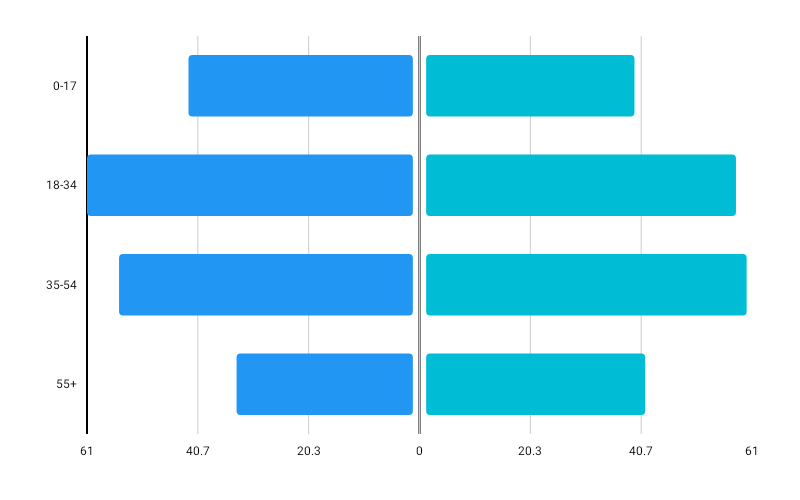

# DivergingBarChart

Best for comparing two opposed series across the same categories — population pyramids, agree/disagree survey splits, imports against exports, gains against losses.



```kotlin
DivergingBarChart(
    data = {
        listOf(
            DivergingData(label = "0–17",  leftValue = 42f, rightValue = 39f),
            DivergingData(label = "18–34", leftValue = 61f, rightValue = 58f),
            DivergingData(label = "35–54", leftValue = 55f, rightValue = 60f),
            DivergingData(label = "55+",   leftValue = 33f, rightValue = 41f),
        )
    },
    modifier = Modifier.fillMaxWidth().height(300.dp),
    leftColor = ChartyColor.Solid(Color(0xFF6650A4)),
    rightColor = ChartyColor.Solid(Color(0xFF03DAC5)),
    leftSeriesName = "Male",
    rightSeriesName = "Female",
    onBarClick = { selection -> println("${selection.side}: ${selection.value}") },
)
```

One row per category, split about a centre axis: the left series grows leftwards, the right series rightwards. **The side encodes the direction, so both values must be non-negative** — `leftValue` and `rightValue` are magnitudes, and a negative one throws. This is the opposite convention from `BarChart`'s `NegativeValuesDrawMode.BELOW_AXIS`, where one series is split by the sign of its values.

The centre axis is pinned to the plot's horizontal midpoint so both halves always get equal room. Tick labels are formatted with `abs()`, because the side already says which series a bar belongs to.

Each `DivergingData` may carry its own `leftColor` and `rightColor`, overriding the chart-level colors.

## Shared or independent scales

```kotlin
divergingConfig = DivergingBarChartConfig(sideScaling = DivergingSideScaling.SHARED)
```

`SHARED` (the default) scales both halves by the maximum across **both** series, so a bar's length is comparable across the axis — the reading a population pyramid depends on.

`INDEPENDENT` gives each half its own maximum, which fills the plot when the two series differ by an order of magnitude. A single linear axis can no longer describe both halves, so the tick labels are suppressed; turn on `showValueLabels` to keep the numbers readable.

## Centre gap

```kotlin
divergingConfig = DivergingBarChartConfig(centerGapFraction = 0.12f)
```

Widens the gutter either side of the centre axis. Category labels sit in the **left gutter**, as on every other horizontal chart, so they do not shrink as this grows.

## Value labels

```kotlin
divergingConfig = DivergingBarChartConfig(
    showValueLabels = true,
    valueFormatter = { value -> "${value.toInt()}k" },
)
```

## Tooltip

```kotlin
tooltip = ChartTooltip.compose { Text(text = "${data.data.label}: ${data.value}") }
```

The click and tooltip payload is a `DivergingSelection` — the row plus the `DivergingSide` that was tapped, with `value` reading the tapped half.

## Accessibility

A chart summary plus one focusable node per row, each announcing the category and both series by the names you gave in `leftSeriesName` and `rightSeriesName`.

## Configuration

`DivergingBarChartConfig(barWidthFraction, cornerRadius, sideScaling, centerGapFraction, animation, showValueLabels, valueFormatter, valueLabelStyle, tooltipConfig, tooltipPosition, visibleWindow)`.

`tooltipConfig` defaults to `null`, meaning the ambient [theme](../../customization/theming.md) styles the tooltip.

## Limitations

- No crosshair, no reference line, and no markers.
