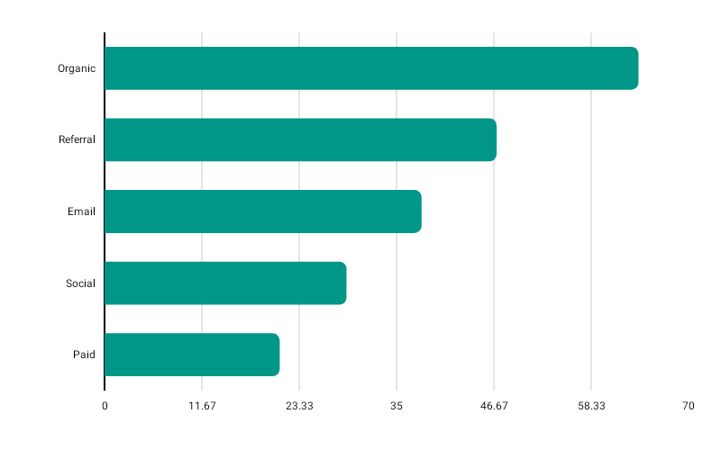

# HorizontalBarChart

Best for long category labels or ranked lists where horizontal reading is more natural.



```kotlin
HorizontalBarChart(
    data = {
        listOf(
            BarData(label = "Category A", value = 340f),
            BarData(label = "Category B", value = 210f),
            BarData(label = "Category C", value = 480f),
        )
    },
    modifier = Modifier.fillMaxWidth().height(250.dp),
    color = ChartyColor.Solid(Color(0xFF0288D1)),
    barConfig = BarChartConfig(
        cornerRadius = CornerRadius.Medium,
        showDataLabels = true,
        animation = Animation.Default,
    ),
    onBarClick = { barData -> println("Clicked: ${barData.label}") },
)
```

Same data and config types as [BarChart](BarChart.md), rotated: bars grow left-to-right, `cornerRadius` rounds the leading (value) end, and negative bars extend to the left of the axis.

## Corner radius

```kotlin
barConfig = BarChartConfig(cornerRadius = CornerRadius.Custom(radius = 20f))
```

`None`, `Small`, `Medium`, `Large`, `ExtraLarge`, or `Custom(radius)` with any non-negative value.

## Rolling window

```kotlin
HorizontalBarChart(
    data = { rankings },
    modifier = Modifier.fillMaxWidth().height(250.dp),
    color = ChartyColor.Solid(Color(0xFF0288D1)),
    barConfig = BarChartConfig(visibleWindow = 12, animation = Animation.Fast),
)
```

`visibleWindow` keeps only the last N rows on screen and slides as data is appended; `null` or at least `2`.

## Persistent markers

Markers anchor to the centre of each bar's value end. A negative `dataIndex` counts back from the end of the drawn data, so `dataIndex = -1` marks the newest row.

```kotlin
barConfig = BarChartConfig(
    visibleWindow = 12,
    markers = listOf(PersistentMarker(dataIndex = -1, label = "Latest")),
)
```

## Animating value changes

```kotlin
barConfig = BarChartConfig(animateValueChanges = true, animation = Animation.Fast)
```

## Crosshair

`HorizontalBarChart` gained a crosshair recently, alongside `BarChart`. It snaps to the nearest bar as you drag and leaves taps alone.

```kotlin
HorizontalBarChart(
    data = { rankings },
    modifier = Modifier.fillMaxWidth().height(250.dp),
    color = ChartyColor.Solid(Color(0xFF0288D1)),
    crosshair = ChartCrosshair(config = ChartCrosshairConfig(showHorizontalLine = false)),
)
```

`barConfig.crosshairConfig` is the older equivalent; the `crosshair` parameter wins when both are set.

## Tooltip

```kotlin
HorizontalBarChart(
    data = { rankings },
    modifier = Modifier.fillMaxWidth().height(250.dp),
    color = ChartyColor.Solid(Color(0xFF0288D1)),
    tooltip = ChartTooltip.compose { Text(text = "${data.label}: ${data.value}") },
)
```

`ChartTooltip.canvas()` is the default; `ChartTooltip.none()` disables it.

## Accessibility

The chart attaches a generated bar-chart summary plus one focusable node per bar; on a horizontal chart the nodes are laid out top-to-bottom to match the visual order.

```kotlin
interactionConfig = ChartInteractionConfig(accessibilityDescription = "Revenue by category, ranked")
```

## Configuration

`HorizontalBarChart` uses `BarChartConfig`; see the [full table on the BarChart page](BarChart.md#barchartconfig).

## Limitations

- `referenceLine` is honoured, but `referenceBand` is **not** drawn on the horizontal chart.
