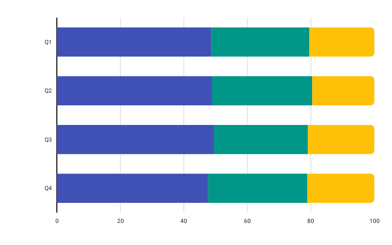

# NormalizedHorizontalBarChart

Best for showing each group's composition as a percentage of the whole — every row always fills 100% of the width.



```kotlin
NormalizedHorizontalBarChart(
    data = {
        listOf(
            BarGroup(
                label = "Market A",
                values = listOf(50f, 30f, 20f),
                colors = listOf(
                    ChartyColor.Solid(Color(0xFF6650A4)),
                    ChartyColor.Solid(Color(0xFFE91E63)),
                    ChartyColor.Solid(Color(0xFF00BCD4)),
                ),
            ),
            BarGroup(label = "Market B", values = listOf(70f, 15f, 15f)),
        )
    },
    modifier = Modifier.fillMaxWidth().height(200.dp),
    colors = ChartyColor.Solid(Color(0xFF6650A4)),
    config = NormalizedHorizontalBarChartConfig(
        barWidthFraction = 0.65f,
        rightCornerRadius = CornerRadius.Small,
        animation = Animation.Default,
    ),
    onSegmentClick = { segment ->
        println("${segment.barGroup.label} segment ${segment.segmentIndex}: ${segment.segmentPercentage}%")
    },
)
```

Values of `0f` or less are skipped during normalization, so give every segment a positive value for meaningful output. The chart-level `colors` defaults to `ChartyColors.DefaultGradient`.

**Click data:** `NormalizedHorizontalBarSegment(barGroup, segmentIndex, segmentValue, segmentPercentage)`

## Fixed 0–100% axis

The value axis is **always 0%–100%** — that is the point of the chart, and it is not configurable. Row totals are therefore invisible here: a row summing to 10 and one summing to 10 000 look identical. Use [StackedHorizontalBarChart](StackedHorizontalBarChart.md) when the absolute totals matter.

## Corner radius

```kotlin
config = NormalizedHorizontalBarChartConfig(rightCornerRadius = CornerRadius.Custom(radius = 12f))
```

Rounds the trailing corners of the last (rightmost) segment.

## Rolling window

```kotlin
config = NormalizedHorizontalBarChartConfig(visibleWindow = 10, animation = Animation.Fast)
```

Keeps only the last N rows on screen; `null` or at least `2`.

## Persistent markers

```kotlin
config = NormalizedHorizontalBarChartConfig(
    visibleWindow = 10,
    markers = listOf(PersistentMarker(dataIndex = -1, label = "Newest")),
)
```

A negative `dataIndex` counts back from the end of the drawn data, so `-1` marks the newest row.

## Animating value changes

```kotlin
config = NormalizedHorizontalBarChartConfig(animateValueChanges = true, animation = Animation.Fast)
```

## Tooltip

```kotlin
NormalizedHorizontalBarChart(
    data = { groups },
    modifier = Modifier.fillMaxWidth().height(200.dp),
    colors = ChartyColors.DefaultGradient,
    tooltip = ChartTooltip.canvas(),
    config = NormalizedHorizontalBarChartConfig(
        tooltipFormatter = { segment -> "${segment.barGroup.label}: ${segment.segmentPercentage.toInt()}%" },
    ),
)
```

## Accessibility

A generated summary plus one focusable node per row, laid out top-to-bottom.

```kotlin
interactionConfig = ChartInteractionConfig(accessibilityDescription = "Market share split by vendor")
```

## `NormalizedHorizontalBarChartConfig`

| Property | Type | Default | Description |
| --- | --- | --- | --- |
| `barWidthFraction` | `Float` | `0.6f` | Row thickness as a fraction of its slot; `0f..1f` |
| `rightCornerRadius` | `CornerRadius` | `CornerRadius.Medium` | Rounds the trailing corners of the last segment |
| `animation` | `Animation` | `Animation.Default` | Entry animation |
| `animateValueChanges` | `Boolean` | `false` | Tween segment values on data change |
| `markers` | `List<PersistentMarker>` | `emptyList()` | Persistent pinned labels |
| `tooltipConfig` | `TooltipConfig?` | `null` (the theme's) | Canvas tooltip appearance |
| `tooltipPosition` | `TooltipPosition` | `AUTO` | `ABOVE`, `BELOW`, or `AUTO` |
| `tooltipFormatter` | `(NormalizedHorizontalBarSegment) -> String` | `"label [i]: n%"` | Tooltip text |
| `visibleWindow` | `Int?` | `null` | Rolling "show last N" window; `null` or `>= 2` |

## Limitations

- No crosshair, no reference line, and no data labels on this chart.
