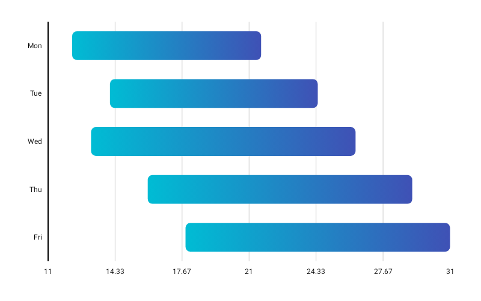

# SpanChart

Best for displaying start-to-end ranges — confidence intervals, temperature highs and lows, bid-ask spreads, Gantt-like durations.



```kotlin
SpanChart(
    data = {
        listOf(
            SpanData(label = "Jan", startValue = 2f,  endValue = 10f),
            SpanData(label = "Feb", startValue = 5f,  endValue = 14f),
            SpanData(label = "Mar", startValue = 8f,  endValue = 18f),
            SpanData(label = "Apr", startValue = 12f, endValue = 22f),
        )
    },
    modifier = Modifier.fillMaxWidth().height(280.dp),
    colors = ChartyColor.Gradient(listOf(Color(0xFF6650A4), Color(0xFF03DAC5))),
    barConfig = BarChartConfig(
        cornerRadius = CornerRadius.Large,
        animation = Animation.Default,
    ),
    onSpanClick = { spanData -> println("Range: ${spanData.startValue}–${spanData.endValue}") },
)
```

The fields are `startValue` and `endValue` (not `minValue`/`maxValue`), and `SpanData` requires `endValue >= startValue`.

`SpanChart` is a **horizontal** chart: one row per label, each row a floating bar running from `startValue` to `endValue` along the value axis. A `SpanData` may carry its own `color: ChartyColor?`, overriding the chart-level `colors`.

## Colours

A `ChartyColor.Gradient` is painted horizontally across each span, from its start to its end.

```kotlin
colors = ChartyColor.Gradient(listOf(Color(0xFF6650A4), Color(0xFF03DAC5)))
```

## Corner radius

```kotlin
barConfig = BarChartConfig(cornerRadius = CornerRadius.Custom(radius = 18f))
```

The radius is applied to all four corners, so a large value gives fully rounded capsule ends.

## Rolling window

```kotlin
barConfig = BarChartConfig(visibleWindow = 15, animation = Animation.Fast)
```

Keeps only the last N spans on screen; `null` or at least `2`.

## Persistent markers

Markers anchor to the centre of each span's end.

```kotlin
barConfig = BarChartConfig(
    visibleWindow = 15,
    markers = listOf(PersistentMarker(dataIndex = -1, label = "Latest")),
)
```

A negative `dataIndex` counts back from the end of the drawn data, so `-1` marks the newest span.

## Animating value changes

```kotlin
barConfig = BarChartConfig(animateValueChanges = true, animation = Animation.Fast)
```

## Tooltip

```kotlin
SpanChart(
    data = { spans },
    modifier = Modifier.fillMaxWidth().height(280.dp),
    colors = ChartyColor.Solid(Color(0xFF6650A4)),
    tooltip = ChartTooltip.compose { Text(text = "${data.label}: ${data.startValue}–${data.endValue}") },
)
```

The canvas tooltip (`ChartTooltip.canvas()`, the default) is styled by `barConfig.tooltipConfig` and `barConfig.tooltipPosition`. Its text is generated as `"<label>: <start> - <end>"`; `barConfig.tooltipFormatter` is **not** used, because that formatter takes a `BarData` and this chart works with `SpanData`.

## Crosshair

A span has a start and an end, so the guide rests on the centre of each span's **end edge** — the point its length reads to, and where its marker is pinned. `SpanChart` is horizontal, so the crosshair snaps along y and its guide line is horizontal. The label reads the whole range, `label: start - end`, the same text a tap shows.

Taps are untouched: the crosshair runs as its own gesture, so tapping still raises the tooltip and fires the click callback. Streaming scrollback does not survive a crosshair — the crosshair owns the drag.

## Accessibility

The chart attaches a summary ("Span chart, N spans.") plus one focusable node per span, each announcing its label and its start-to-end range.

```kotlin
interactionConfig = ChartInteractionConfig(accessibilityDescription = "Monthly temperature range")
```

## Configuration

`SpanChart` uses `BarChartConfig`; see the [full table on the BarChart page](BarChart.md#barchartconfig). The properties that apply here are `barWidthFraction` (span thickness), `cornerRadius`, `animation`, `animateValueChanges`, `markers`, `tooltipConfig`, `tooltipPosition`, and `visibleWindow`.

## Limitations

- `negativeValuesDrawMode`, `referenceLine`, `referenceBand`, `showDataLabels`, and `tooltipFormatter` from `BarChartConfig` have no effect here.
