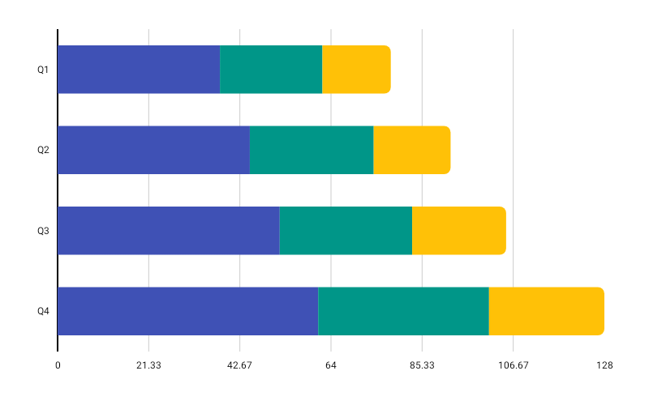

# StackedHorizontalBarChart

Best for showing cumulative part-to-whole composition across categories in a horizontal layout.



```kotlin
StackedHorizontalBarChart(
    data = {
        listOf(
            BarGroup(label = "Product A", values = listOf(30f, 50f, 20f)),
            BarGroup(label = "Product B", values = listOf(60f, 25f, 45f)),
        )
    },
    modifier = Modifier.fillMaxWidth().height(200.dp),
    colors = ChartyColor.Solid(Color(0xFF00897B)),
    config = StackedHorizontalBarChartConfig(
        barWidthFraction = 0.6f,
        rightCornerRadius = CornerRadius.Medium,
        animation = Animation.Default,
    ),
    onSegmentClick = { segment -> println("Tapped ${segment.barGroup.label} segment ${segment.segmentIndex}") },
)
```

Every group must have at least one value, and **all values must be non-negative** — the chart throws an `IllegalArgumentException` otherwise.

Unlike [NormalizedHorizontalBarChart](NormalizedHorizontalBarChart.md), rows here keep their real lengths: a row with a larger total is visibly longer.

**Click data:** `StackedHorizontalBarSegment(barGroup, segmentIndex, segmentValue)`

## Corner radius

```kotlin
config = StackedHorizontalBarChartConfig(rightCornerRadius = CornerRadius.Custom(radius = 10f))
```

Rounds the trailing (rightmost) corners of the last segment. `None`, `Small`, `Medium`, `Large`, `ExtraLarge`, or `Custom(radius)`.

## Rolling window

```kotlin
config = StackedHorizontalBarChartConfig(visibleWindow = 10, animation = Animation.Fast)
```

Keeps only the last N rows on screen; `null` or at least `2`.

## Persistent markers

```kotlin
config = StackedHorizontalBarChartConfig(
    visibleWindow = 10,
    markers = listOf(PersistentMarker(dataIndex = -1, label = "Newest")),
)
```

A negative `dataIndex` counts back from the end of the drawn data, so `-1` marks the newest row.

## Animating value changes

```kotlin
config = StackedHorizontalBarChartConfig(animateValueChanges = true, animation = Animation.Fast)
```

## Tooltip

```kotlin
StackedHorizontalBarChart(
    data = { groups },
    modifier = Modifier.fillMaxWidth().height(200.dp),
    colors = ChartyColors.DefaultGradient,
    tooltip = ChartTooltip.canvas(),
    config = StackedHorizontalBarChartConfig(
        tooltipFormatter = { segment -> "${segment.barGroup.label}: ${segment.segmentValue}" },
    ),
)
```

## Accessibility

A generated stacked-bar summary plus one focusable node per row, laid out top-to-bottom.

```kotlin
interactionConfig = ChartInteractionConfig(accessibilityDescription = "Revenue composition per product")
```

## `StackedHorizontalBarChartConfig`

| Property | Type | Default | Description |
| --- | --- | --- | --- |
| `barWidthFraction` | `Float` | `0.6f` | Row thickness as a fraction of its slot; `0f..1f` |
| `barSpacing` | `Float` | `0f` | Extra gap between rows; non-negative |
| `rightCornerRadius` | `CornerRadius` | `CornerRadius.Medium` | Rounds the trailing corners of the last segment |
| `animation` | `Animation` | `Animation.Default` | Grow-from-left entry animation |
| `animateValueChanges` | `Boolean` | `false` | Tween segment values on data change |
| `referenceLine` | `ReferenceLineConfig?` | `null` | Optional vertical guide line at a fixed value |
| `markers` | `List<PersistentMarker>` | `emptyList()` | Persistent pinned labels |
| `tooltipConfig` | `TooltipConfig?` | `null` (the theme's) | Canvas tooltip appearance |
| `tooltipPosition` | `TooltipPosition` | `AUTO` | `ABOVE`, `BELOW`, or `AUTO` |
| `tooltipFormatter` | `(StackedHorizontalBarSegment) -> String` | `"label [i]: value"` | Tooltip text |
| `visibleWindow` | `Int?` | `null` | Rolling "show last N" window; `null` or `>= 2` |

## Limitations

- No crosshair: there is no `crosshair` parameter and no `crosshairConfig` on this config.
- No data labels: `showDataLabels` exists only on `BarChartConfig` and `StackedBarChartConfig`.
