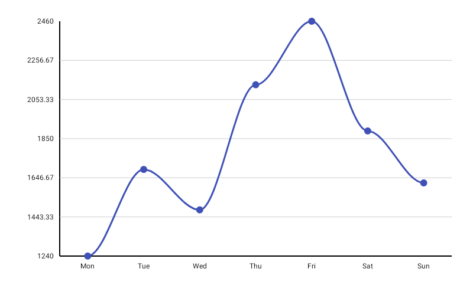
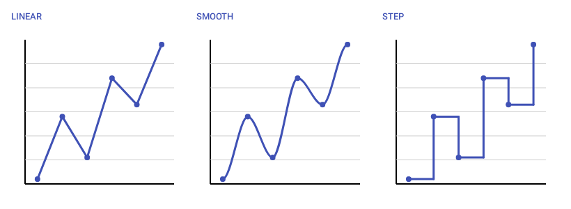

# LineChart

Best for visualizing a single data series over time or an ordered sequence of values.



```kotlin
LineChart(
    data = {
        listOf(
            LineData(label = "Jan", value = 120f),
            LineData(label = "Feb", value = 95f),
            LineData(label = "Mar", value = 180f),
            LineData(label = "Apr", value = 140f),
            LineData(label = "May", value = 220f),
            LineData(label = "Jun", value = 175f),
        )
    },
    modifier = Modifier.fillMaxWidth().height(300.dp),
    color = ChartyColor.Solid(Color(0xFF6650A4)),
    lineConfig = LineChartConfig(
        lineWidth = 2f,
        showPoints = true,
        pointRadius = 4f,
        interpolation = LineInterpolation.SMOOTH,
        animation = Animation.Default,
    ),
    onPointClick = { lineData -> println("Clicked: ${lineData.label} = ${lineData.value}") },
)
```

## Interpolation

`interpolation` decides how consecutive points are connected:

- `LineInterpolation.LINEAR` — straight segments (default)
- `LineInterpolation.SMOOTH` — a cubic-bezier curve through the points
- `LineInterpolation.STEP` — the value holds until the next x, then jumps



```kotlin
LineChart(
    data = { series },
    modifier = Modifier.fillMaxWidth().height(300.dp),
    color = ChartyColor.Solid(Color(0xFF6650A4)),
    lineConfig = LineChartConfig(interpolation = LineInterpolation.STEP),
)
```

The older `smoothCurve` boolean still works, but only as a fallback: `interpolation` wins unless it is `LINEAR`, in which case `smoothCurve = true` draws a smooth curve. Prefer `interpolation` in new code.

## Rolling window

`visibleWindow` keeps only the last N points on screen. As you append data the window slides, so a chart fed from a stream shows a moving view instead of squeezing an ever-growing series into the same width.

```kotlin
LineChart(
    data = { readings },
    modifier = Modifier.fillMaxWidth().height(300.dp),
    color = ChartyColor.Solid(Color(0xFF6650A4)),
    lineConfig = LineChartConfig(visibleWindow = 60, animation = Animation.Fast),
)
```

It must be `null` (disabled) or at least `2`. Pair it with `ChartInteractionConfig(streamingState = …)` to let the reader drag back through history, and with `jumpToLatest` to offer a "back to now" control.

## Persistent markers

`markers` pins a permanent dot and callout to a data index — a peak, a target, "today". A **negative `dataIndex` counts back from the end of the drawn data**, so `dataIndex = -1` labels the newest point. That is the main use, and it is what keeps a label attached to the latest value of a rolling `visibleWindow`.

```kotlin
LineChart(
    data = { readings },
    modifier = Modifier.fillMaxWidth().height(300.dp),
    color = ChartyColor.Solid(Color(0xFF6650A4)),
    lineConfig = LineChartConfig(
        visibleWindow = 60,
        markers = listOf(PersistentMarker(dataIndex = -1)),
    ),
)
```

With no `label` the marker shows the point's formatted value. Markers whose index falls outside the drawn data are skipped.

```kotlin
lineConfig = LineChartConfig(
    markers = listOf(
        PersistentMarker(dataIndex = 3, label = "Peak", showGuideLine = true),
        PersistentMarker(dataIndex = -1, dotColor = ChartyColor.Solid(Color(0xFFE53935))),
    ),
)
```

## Animating value changes

`animateValueChanges = true` tweens each point toward its new position when the data changes, instead of the line jumping.

```kotlin
lineConfig = LineChartConfig(animateValueChanges = true, animation = Animation.Fast)
```

## Crosshair

`crosshair` adds a draggable guide line that snaps to the nearest point. It is a drag gesture and leaves taps alone, so tap-to-tooltip and `onPointClick` keep working alongside it.

```kotlin
LineChart(
    data = { series },
    modifier = Modifier.fillMaxWidth().height(300.dp),
    color = ChartyColor.Solid(Color(0xFF6650A4)),
    crosshair = ChartCrosshair(
        config = ChartCrosshairConfig(
            verticalLineColor = ChartyColor.Solid(Color(0xFF6650A4)),
            showHorizontalLine = false,
            dismissOnRelease = true,
        ),
    ),
)
```

Supply your own label composable when the built-in pill is not enough:

```kotlin
crosshair = ChartCrosshair(
    config = ChartCrosshairConfig(showHorizontalLine = false),
    label = { Text(text = "${data.label}: ${data.value}") },
)
```

`LineChartConfig.crosshairConfig` is the older way to switch the crosshair on and still works; the `crosshair` parameter takes precedence when both are set. Because the crosshair owns the horizontal drag, streaming scrollback is unavailable on a chart that has one.

## Tooltip

```kotlin
LineChart(
    data = { series },
    modifier = Modifier.fillMaxWidth().height(300.dp),
    color = ChartyColor.Solid(Color(0xFF6650A4)),
    tooltip = ChartTooltip.canvas(),
    lineConfig = LineChartConfig(
        tooltipFormatter = { lineData -> "${lineData.label}: ${lineData.value}" },
    ),
)
```

`ChartTooltip.canvas()` (the default) draws the built-in bubble on the canvas, styled by `lineConfig.tooltipConfig`. `ChartTooltip.compose { … }` renders any composable positioned over the selected point. `ChartTooltip.none()` disables it.

## Accessibility

The chart attaches a generated summary ("Line chart, 12 data points. Range: … Peak: … Lowest: …") plus one focusable node per data point, so screen readers can traverse the series point by point. Override the summary through `interactionConfig`:

```kotlin
LineChart(
    data = { series },
    modifier = Modifier.fillMaxWidth().height(300.dp),
    color = ChartyColor.Solid(Color(0xFF6650A4)),
    interactionConfig = ChartInteractionConfig(accessibilityDescription = "Monthly revenue trend"),
)
```

Pass an empty string to suppress the summary.

## `LineChartConfig`

Shared by `LineChart`, `AreaChart`, `MultilineChart`, and `StackedAreaChart` — not every property is honoured by all four; see each chart's page.

| Property | Type | Default | Description |
| --- | --- | --- | --- |
| `lineWidth` | `Float` | `3f` | Stroke width in pixels; must be greater than `0` |
| `showPoints` | `Boolean` | `true` | Draws a dot at each data point |
| `pointRadius` | `Float` | `6f` | Radius of those dots; must be greater than `0` |
| `pointAlpha` | `Float` | `1f` | Opacity of the dots, `0f..1f` |
| `strokeCap` | `StrokeCap` | `StrokeCap.Round` | Cap of the line stroke |
| `smoothCurve` | `Boolean` | `false` | Legacy smooth-curve flag; only consulted when `interpolation` is `LINEAR` |
| `interpolation` | `LineInterpolation` | `LINEAR` | `LINEAR`, `SMOOTH`, or `STEP` |
| `negativeValuesDrawMode` | `NegativeValuesDrawMode` | `BELOW_AXIS` | `BELOW_AXIS` or `FROM_MIN_VALUE` |
| `animation` | `Animation` | `Animation.Default` | Entry animation (800 ms tween) |
| `animateValueChanges` | `Boolean` | `false` | Tween values to new positions on data change |
| `referenceLine` | `ReferenceLineConfig?` | `null` | Optional horizontal guide line |
| `referenceBand` | `ReferenceBandConfig?` | `null` | Optional shaded value band |
| `markers` | `List<PersistentMarker>` | `emptyList()` | Persistent pinned labels |
| `tooltipConfig` | `TooltipConfig?` | `null` (the theme's) | Canvas tooltip appearance |
| `tooltipPosition` | `TooltipPosition` | `AUTO` | `ABOVE`, `BELOW`, or `AUTO` |
| `tooltipFormatter` | `(LineData) -> String` | `"label: value"` | Tooltip text |
| `crosshairConfig` | `ChartCrosshairConfig?` | `null` | Legacy crosshair switch; `crosshair` takes precedence |
| `highlightSelectedColumn` | `Boolean` | `false` | Shades the column of the selected point |
| `selectionColumnColor` | `ChartyColor` | `Solid(#142962FF)` | Colour of that shading |
| `selectionColumnWidth` | `Float?` | `null` | Fixed width for the shading; `null` derives it from spacing |
| `legendLabels` | `List<String>` | `emptyList()` | Legend entries (multi-series charts) |
| `legendTextStyle` | `TextStyle` | 12 sp | Legend text style |
| `showGradientFill` | `Boolean` | `false` | Shaded area under each series (multi-series charts) |
| `gradientFillAlpha` | `Float` | `0.3f` | Opacity of that shading, `0f..1f` |
| `fillAlpha` | `Float` | `0.3f` | Opacity of the `AreaChart` fill, `0f..1f` |
| `downsampleThreshold` | `Int?` | `null` | Max points to render (LTTB); `null` or `>= 3` |
| `visibleWindow` | `Int?` | `null` | Rolling "show last N" window; `null` or `>= 2` |
