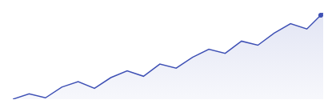

# Sparkline

Best for an inline trend inside something else — a table row, a list item, a dashboard tile, a card header. It plots a plain `List<Float>` across the whole area you give it, with no chrome of any kind.



```kotlin
Sparkline(
    data = { listOf(12f, 15f, 11f, 18f, 22f, 19f, 26f) },
    modifier = Modifier.width(120.dp).height(32.dp),
    color = ChartyColor.Solid(Color(0xFF2962FF)),
)
```

Note the data type: `Sparkline` takes raw `Float` values, not `LineData`. There are no labels because there is nowhere to draw them.

## No axes, labels, tooltip, or interaction — by design

A sparkline is deliberately the one chart in Charty with no scaffold and no gestures:

- **No axes, grid, or labels.** The line is normalised to fill the *entire* draw area — the maximum value touches the top edge, the minimum touches the bottom. There is no padding, so it lines up flush with adjacent text.
- **No tooltip, crosshair, or click callback.** It is meant to sit inside a row or cell that already owns the touch target; adding a second gesture consumer there would fight with the surrounding list.
- **No `visibleWindow`, `markers`, or `animateValueChanges`.** Those belong to the Cartesian charts built on `ChartScaffold`; `Sparkline` draws straight onto a `Canvas`.

The consequence worth remembering: because every sparkline normalises to its own min and max, **two sparklines are not comparable to each other**. A flat-looking series and a dramatic one may span very different value ranges. Print the actual number next to it.

When you need axes, a tooltip, or interaction, use [LineChart](LineChart.md) or [AreaChart](AreaChart.md) instead.

## Edge cases

- An empty list draws nothing.
- A single value draws a flat line at mid-height across the full width.
- A series where every value is equal also draws a centred flat line, rather than pinning to the top or bottom.

## Fill and last-point dot

```kotlin
Sparkline(
    data = { revenueByDay },
    modifier = Modifier.width(160.dp).height(40.dp),
    color = ChartyColor.Gradient(listOf(Color(0xFF43A047), Color(0xFF1B5E20))),
    config = SparklineConfig(
        lineWidth = 2f,
        showFill = true,
        fillAlpha = 0.2f,
        showLastPointDot = true,
        lastPointDotRadius = 4f,
    ),
)
```

A `ChartyColor.Gradient` paints the stroke, the fill, and the dot.

## Smooth curve

```kotlin
Sparkline(
    data = { cpuLoad },
    modifier = Modifier.width(120.dp).height(32.dp),
    config = SparklineConfig(smoothCurve = true),
)
```

`smoothCurve = true` connects the values with a cubic-bezier curve; `false` (the default) uses straight segments. There is no `LineInterpolation` parameter — a sparkline offers only these two.

## Animation

Animation is **off by default** here, unlike every other chart, because a sparkline usually appears inside a scrolling list where a reveal on every bind is noise. Turn it on explicitly when the sparkline is a focal element:

```kotlin
Sparkline(
    data = { weeklyOrders },
    modifier = Modifier.width(120.dp).height(32.dp),
    config = SparklineConfig(animation = Animation.Fast),
)
```

The entry animation clips the line and fill from the left and fades the last-point dot in.

## Accessibility

By default the sparkline attaches a generated summary — value count, first and last value, and the range. Pass an empty string to suppress it, which is usually right when the sparkline sits next to a number that already says the same thing.

```kotlin
Sparkline(
    data = { weeklyOrders },
    modifier = Modifier.width(120.dp).height(32.dp),
    accessibilityDescription = "",
)
```

There is no per-point screen-reader traversal — the chart has no data points to traverse in the semantics tree.

## `SparklineConfig`

| Property | Type | Default | Description |
| --- | --- | --- | --- |
| `lineWidth` | `Float` | `1.5f` | Stroke width in pixels; must be greater than `0f` |
| `showFill` | `Boolean` | `true` | Fills the area under the line down to the bottom edge |
| `fillAlpha` | `Float` | `0.15f` | Opacity of the fill; must be in `0f..1f` |
| `showLastPointDot` | `Boolean` | `true` | Draws a dot on the most recent value |
| `lastPointDotRadius` | `Float` | `3f` | Radius of that dot in pixels; must be greater than `0f` |
| `smoothCurve` | `Boolean` | `false` | Cubic-bezier curve instead of straight segments |
| `animation` | `Animation` | `Animation.Disabled` | Left-to-right reveal; disabled by default |
