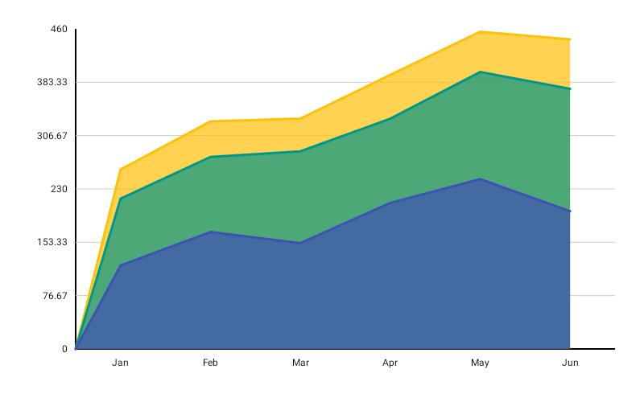

# StackedAreaChart

Best for showing how multiple series combine to form a cumulative total, emphasizing both individual contributions and the whole.



```kotlin
StackedAreaChart(
    data = {
        listOf(
            LineGroup(label = "Q1", values = listOf(200f, 150f, 100f)),
            LineGroup(label = "Q2", values = listOf(250f, 180f, 120f)),
            LineGroup(label = "Q3", values = listOf(300f, 200f, 140f)),
            LineGroup(label = "Q4", values = listOf(280f, 220f, 160f)),
        )
    },
    modifier = Modifier.fillMaxWidth().height(320.dp),
    colors = ChartyColor.Gradient(
        listOf(Color(0xFF6650A4), Color(0xFFE91E63), Color(0xFF00BCD4)),
    ),
    lineConfig = LineChartConfig(
        interpolation = LineInterpolation.SMOOTH,
        legendLabels = listOf("Series A", "Series B", "Series C"),
        animation = Animation.Default,
    ),
    fillAlpha = 0.5f,
    onAreaClick = { point -> println("Series ${point.seriesIndex} in ${point.lineGroup.label}") },
)
```

Each `LineGroup.values[i]` is the value for series `i` at that x-position. Values are accumulated from bottom to top, so the topmost boundary is the sum of all series at each point.

`fillAlpha` is a **chart-level parameter** here (default `0.7f`), not a config property — it must be in `0f..1f`. Lower values keep the stacked layers readable where they overlap.

**Click data:** `StackedAreaPoint(lineGroup, seriesIndex, dataIndex, value, cumulativeValue)`

## Interpolation

`StackedAreaChart` honours `LineInterpolation` for every band, and the fill follows the same outline as the stroke above it. Earlier versions of the library ignored this setting on this chart; it is applied now.

```kotlin
lineConfig = LineChartConfig(interpolation = LineInterpolation.STEP)
```

## Legend

```kotlin
lineConfig = LineChartConfig(
    legendLabels = listOf("Series A", "Series B", "Series C"),
    legendTextStyle = TextStyle(fontSize = 12.sp),
)
```

One entry per series, rendered as colour dots below the chart.

## Rolling window

```kotlin
StackedAreaChart(
    data = { groups },
    modifier = Modifier.fillMaxWidth().height(320.dp),
    colors = ChartyColor.Gradient(listOf(Color(0xFF6650A4), Color(0xFFE91E63))),
    lineConfig = LineChartConfig(visibleWindow = 40, animation = Animation.Fast),
    fillAlpha = 0.5f,
)
```

The window applies to the list of `LineGroup`s, so every band slides together. It must be `null` or at least `2`.

## Animating value changes

```kotlin
lineConfig = LineChartConfig(animateValueChanges = true, animation = Animation.Fast)
```

## Crosshair

```kotlin
StackedAreaChart(
    data = { groups },
    modifier = Modifier.fillMaxWidth().height(320.dp),
    colors = ChartyColor.Gradient(listOf(Color(0xFF6650A4), Color(0xFFE91E63), Color(0xFF00BCD4))),
    fillAlpha = 0.5f,
    crosshair = ChartCrosshair(config = ChartCrosshairConfig(dismissOnRelease = true)),
)
```

The crosshair snaps to the top cumulative position at the nearest x and its label covers all series at that point. Note its data type: the crosshair here is a `ChartCrosshair<LineGroup>`, so a custom `label` receives the whole group.

```kotlin
crosshair = ChartCrosshair<LineGroup>(
    label = { Text(text = "${data.label}: total ${data.values.sum()}") },
)
```

`lineConfig.crosshairConfig` is the older equivalent; the `crosshair` parameter wins when both are set.

## Tooltip

`StackedAreaChart` has **no `tooltip` parameter** — tapping a band raises the built-in canvas tooltip only, styled through `lineConfig.tooltipConfig` and `lineConfig.tooltipPosition`. Its text is generated as `"<group label>: <value>"`; `lineConfig.tooltipFormatter` is not consulted.

## Accessibility

The chart attaches a generated stacked-area summary plus one focusable node per x-position for screen-reader traversal.

```kotlin
interactionConfig = ChartInteractionConfig(accessibilityDescription = "Quarterly revenue split by product line")
```

## Configuration

`StackedAreaChart` uses `LineChartConfig`; see the [full table on the LineChart page](LineChart.md#linechartconfig).

## Limitations

- `markers` is present on `LineChartConfig` but **`StackedAreaChart` does not draw persistent markers**.
- `referenceBand` is honoured, but `referenceLine` is not drawn on this chart.
- `lineConfig.fillAlpha` is ignored — use the chart-level `fillAlpha` parameter.
