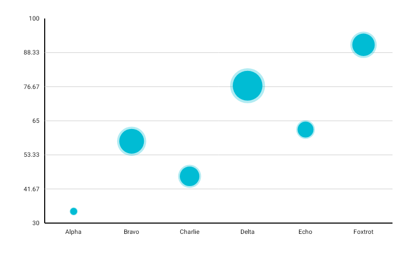

# BubbleChart

Best for three-variable data where the category, the y-position, and a third variable (bubble size) are all meaningful.



```kotlin
BubbleChart(
    data = {
        listOf(
            BubbleData(label = "Alpha",   yValue = 200f, size = 40f),
            BubbleData(label = "Beta",    yValue = 350f, size = 80f),
            BubbleData(label = "Gamma",   yValue = 150f, size = 20f),
            BubbleData(label = "Delta",   yValue = 420f, size = 60f),
            BubbleData(label = "Epsilon", yValue = 280f, size = 100f),
        )
    },
    modifier = Modifier.fillMaxWidth().height(320.dp),
    color = ChartyColor.Gradient(listOf(Color(0xFF6650A4), Color(0xFF03DAC5))),
    config = PointChartConfig(pointRadius = 24f, animation = Animation.Default),
    minBubbleRadius = 12f,
    onBubbleClick = { bubbleData -> println("${bubbleData.label}: y=${bubbleData.yValue}, size=${bubbleData.size}") },
)
```

`size` is interpolated between `minBubbleRadius` and `config.pointRadius`, which acts as the **maximum** radius here — not the fixed dot radius it is on [PointChart](PointChart.md).

**`config.pointRadius` must be strictly greater than `minBubbleRadius`, or the chart throws.** The defaults do not satisfy this: `PointChartConfig().pointRadius` is `8f` while `minBubbleRadius` defaults to `10f`, so calling `BubbleChart` without setting either raises an `IllegalArgumentException`. Always set `pointRadius` above your `minBubbleRadius`.

`BubbleData.size` must be positive and `yValue` must be finite. `BubbleData` also has an optional `xValue`, which the chart does not currently use for positioning — bubbles are laid out evenly by index.

## Rolling window

```kotlin
BubbleChart(
    data = { samples },
    modifier = Modifier.fillMaxWidth().height(320.dp),
    color = ChartyColor.Solid(Color(0xFF6650A4)),
    config = PointChartConfig(pointRadius = 24f, visibleWindow = 30, animation = Animation.Fast),
    minBubbleRadius = 12f,
)
```

Keeps only the last N bubbles on screen; `null` or at least `2`.

## Persistent markers

Markers anchor to bubble centres. A negative `dataIndex` counts back from the end of the drawn data, so `-1` marks the newest bubble.

```kotlin
config = PointChartConfig(
    pointRadius = 24f,
    visibleWindow = 30,
    markers = listOf(PersistentMarker(dataIndex = -1, label = "Latest")),
)
```

A marker with no `label` shows the bubble's formatted `yValue`.

## Animating value changes

```kotlin
config = PointChartConfig(pointRadius = 24f, animateValueChanges = true, animation = Animation.Fast)
```

## Crosshair

```kotlin
BubbleChart(
    data = { samples },
    modifier = Modifier.fillMaxWidth().height(320.dp),
    color = ChartyColor.Solid(Color(0xFF6650A4)),
    config = PointChartConfig(pointRadius = 24f),
    minBubbleRadius = 12f,
    crosshair = ChartCrosshair(config = ChartCrosshairConfig(dismissOnRelease = true)),
)
```

The crosshair snaps to bubble centres by x-position and, being a drag gesture, leaves `onBubbleClick` intact. `config.crosshairConfig` is the older equivalent; the `crosshair` parameter wins when both are set.

## Accessibility

A generated bubble-chart summary ("Bubble chart, 5 bubbles. Y-axis range: … Largest bubble: …") plus one focusable node per bubble.

```kotlin
interactionConfig = ChartInteractionConfig(accessibilityDescription = "Deal size versus close rate by segment")
```

## Configuration

`BubbleChart` uses `PointChartConfig`; see the [full table on the PointChart page](PointChart.md#pointchartconfig).

## Limitations

- **No tooltip.** `BubbleChart` has no `tooltip` parameter and never raises the canvas tooltip, so `config.tooltipConfig`, `tooltipPosition`, and `tooltipFormatter` have no effect. Use `onBubbleClick` or the crosshair to surface values.
- `referenceLine`, `referenceBand`, `highlightSelectedColumn`, and `downsampleThreshold` from `PointChartConfig` are not applied on this chart.
- There is no size legend; render one yourself if the size mapping needs explaining.
