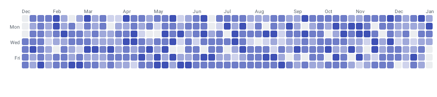

# CalendarHeatmapChart

Best for visualizing daily activity or intensity over weeks and months in a calendar grid, like GitHub's contribution graph. For a grid that is not tied to dates, see [MatrixHeatmapChart](MatrixHeatmapChart.md).



```kotlin
CalendarHeatmapChart(
    data = {
        listOf(
            CalendarData(year = 2024, month = 1, day = 1, value = 3f),
            CalendarData(year = 2024, month = 1, day = 2, value = 7f),
            CalendarData(year = 2024, month = 1, day = 3, value = 0f),
            CalendarData(year = 2024, month = 1, day = 4, value = 12f),
            CalendarData(year = 2024, month = 1, day = 7, value = 5f),
        )
    },
    modifier = Modifier.fillMaxWidth(),
    config = CalendarHeatmapConfig(animation = Animation.Default),
    visibleWeeks = 12,
    scrollEnabled = true,
    onDayClick = { data -> println("${data.year}-${data.month}-${data.day}: ${data.value}") },
)
```

`CalendarData` validates `month` in `1..12` and `day` in `1..31` at construction. Data points need not be contiguous — missing dates render as empty cells.

`visibleWeeks` is nullable (`Int?`, default `null`): leave it out to fit the whole range, or set it to cap how many week columns are on screen at once. `scrollEnabled` (default `true`) allows horizontal scrolling through the full date range.

## Cell appearance

```kotlin
config = CalendarHeatmapConfig(
    cellShape = CellShape.Circle,
    cellSize = 16.dp,
    cellSpacing = 3.dp,
)
```

`CellShape` is a sealed class: `Square`, `RoundedSquare(cornerRadius)`, `Circle`, or `Diamond`.

## Intensity colours

```kotlin
config = CalendarHeatmapConfig(
    intensityColors = listOf(
        Color(0xFFD7CCF7),
        Color(0xFFB39DDB),
        Color(0xFF7E57C2),
        Color(0xFF4527A0),
    ),
    emptyColor = Color(0xFFF0F0F0),
)
```

Values are interpolated across `intensityColors` from lowest to highest; days with no data use `emptyColor`. The list must not be empty. Note these are plain `Color` values, not `ChartyColor`.

## Labels and week start

```kotlin
config = CalendarHeatmapConfig(
    showMonthLabels = true,
    showDayLabels = true,
    weekStartDay = WeekStartDay.MONDAY,
    labelTextStyle = TextStyle(fontSize = 11.sp),
)
```

## Tooltip

Tapping a day with data raises the built-in canvas tooltip. There is **no `tooltip` parameter** on this chart, so the canvas bubble is the only option; style and format it through the config.

```kotlin
config = CalendarHeatmapConfig(
    tooltipConfig = TooltipConfig(showArrow = false),
    tooltipFormatter = { data -> "${data.value.toInt()} commits on ${data.month}/${data.day}" },
)
```

## Accessibility

The chart attaches a generated summary to its root: "Calendar heatmap, N days with data. Busiest day: …". Unlike most charts there is **no way to override or suppress it** — `CalendarHeatmapChart` has no `accessibilityDescription` parameter and no `interactionConfig`. There is also no per-day screen-reader traversal.

## `CalendarHeatmapConfig`

| Property | Type | Default | Description |
| --- | --- | --- | --- |
| `intensityColors` | `List<Color>` | four GitHub-green shades | Low-to-high intensity scale; must not be empty |
| `emptyColor` | `Color` | `#EBEDF0` | Fill for days with no data |
| `cellShape` | `CellShape` | `RoundedSquare(cornerRadius = 2f)` | `Square`, `RoundedSquare`, `Circle`, or `Diamond` |
| `cellSize` | `Dp` | `14.dp` | Side length of each cell |
| `cellSpacing` | `Dp` | `2.dp` | Gap between cells |
| `showMonthLabels` | `Boolean` | `true` | Draws month abbreviations above the grid |
| `showDayLabels` | `Boolean` | `true` | Draws day-of-week labels beside the grid |
| `weekStartDay` | `WeekStartDay` | `SUNDAY` | `SUNDAY` or `MONDAY` |
| `labelTextStyle` | `TextStyle` | 10 sp, `#57606A` | Style of the month and day labels |
| `animation` | `Animation` | `Animation.Default` | Cell entry animation |
| `tooltipConfig` | `TooltipConfig?` | `null` (the theme's) | Canvas tooltip appearance |
| `tooltipFormatter` | `(CalendarData) -> String` | `"<value> on <Mon> <day>, <year>"` | Tooltip text |

## Limitations

- Not a Cartesian chart: no `visibleWindow`, no `markers`, no `animateValueChanges`, no crosshair, and no `interactionConfig` parameter.
- There is no legend for the intensity scale; render one yourself.
