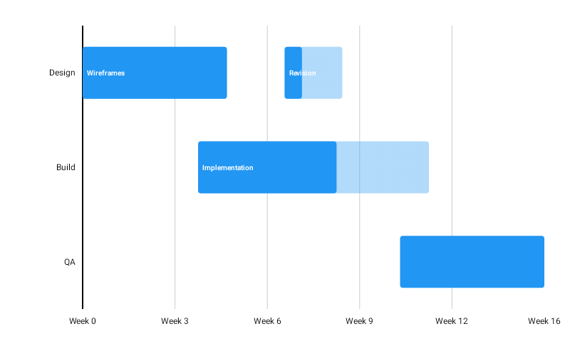

# GanttChart

Best for schedules and occupancy — project plans, shift rosters, booking calendars, machine utilisation: anything where each row holds several ranges rather than one.



```kotlin
GanttChart(
    data = {
        listOf(
            GanttRow(
                label = "Design",
                segments = listOf(
                    GanttSegment(startValue = 0f, endValue = 5f, progress = 1f),
                    GanttSegment(startValue = 7f, endValue = 9f, label = "Revision"),
                ),
            ),
            GanttRow(
                label = "Build",
                segments = listOf(GanttSegment(startValue = 4f, endValue = 12f, progress = 0.6f)),
            ),
        )
    },
    modifier = Modifier.fillMaxWidth().height(280.dp),
    color = ChartyColor.Solid(Color(0xFF6650A4)),
    onSegmentClick = { selection -> println("${selection.row.label}: ${selection.segment.startValue}") },
)
```

One row per label, with any number of segments laid out along the value axis. This is the many-ranges-per-row case that [`SpanChart`](../bar/SpanChart.md) cannot express — a span is exactly one range per row, with no per-segment colour, label, or progress.

A segment requires `endValue > startValue`. **Segments of one row must not overlap**: overlapping bars on a single row are indistinguishable once drawn, so the constructor throws and names the row. Touching segments are fine, and the order you pass them in does not matter.

## Progress

```kotlin
GanttSegment(startValue = 0f, endValue = 10f, progress = 0.4f)
```

The full segment is drawn at `incompleteAlpha`, with the completed head at full opacity on top. Leave `progress` `null` to draw a plain segment.

## The value axis

The axis is a generic `Float` continuum — the chart hard-codes no notion of time. To label it as dates, pass a formatter through `scaffoldConfig`; see [Datetime axis and localization](../../guides/datetime-axis.md).

> `Float` cannot keep raw epoch-millisecond values distinct. Use offsets from a reference instant, or seconds, and format them on the axis.

## Segment labels

```kotlin
ganttConfig = GanttChartConfig(showSegmentLabels = true)
```

Labels are measured during composition and drawn only where they fit inside their segment.

## Tooltip

```kotlin
tooltip = ChartTooltip.compose { Text(text = "${data.row.label}: ${data.segment.label ?: ""}") }
```

The click and tooltip payload is a `GanttSelection` — the row plus the segment that was tapped.

## Configuration

`GanttChartConfig(barHeightFraction, cornerRadius, animation, incompleteAlpha, showSegmentLabels, segmentLabelStyle, valueFormatter, axisSteps, tooltipConfig, tooltipPosition, visibleWindow)`.

`tooltipConfig` defaults to `null`, meaning the ambient [theme](../../customization/theming.md) styles the tooltip.

## Limitations

- No crosshair, no reference line, and no markers.
