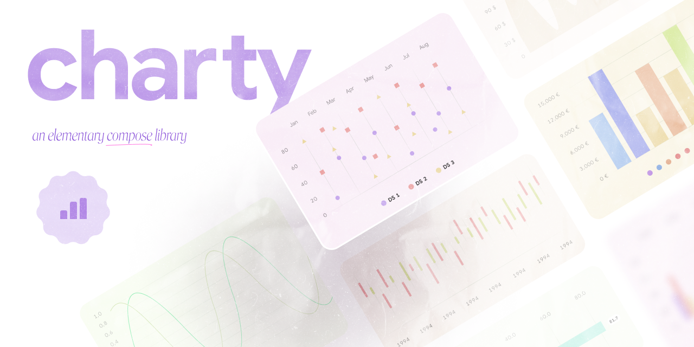

# Welcome to Charty



Charty is a modern charting library for Kotlin Multiplatform, designed to help you easily conjure beautiful and interactive charts for your applications, much like a wizard casting spells in the world of Harry Potter.

## Getting Started

### Version Catalog

If you're using Version Catalog, you can configure the dependency by adding it to your
`libs.versions.toml` file as follows:

```toml
[versions]
#...
charty = "<version>"

[libraries]
#...
charty = { module = "com.himanshoe:charty", version.ref = "charty" }
```

### Gradle

Add the dependency below to your **module**'s `build.gradle.kts` file:

```gradle
dependencies {
    implementation("com.himanshoe:charty:$version")
    
    // if you're using Version Catalog
    implementation(libs.charty)
}
```

For Kotlin Multiplatform, add the dependency below to your commonMain source set's
`build.gradle.kts` file:

```gradle
sourceSets {
    commonMain.dependencies {
            implementation(libs.charty)
     }
}
```

Find the latest release version [here](https://github.com/hi-manshu/Charty/releases)